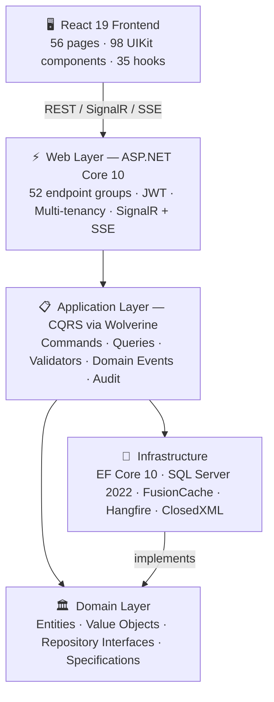

<div align="center">

# NOIR

> *Build in the shadows. Ship in the light.*

**Enterprise .NET 10 + React 19 SaaS Platform**

*Multi-Tenancy · E-commerce · ERP Modules · Clean Architecture*

[](https://dotnet.microsoft.com/)
[](https://react.dev/)
[](https://www.typescriptlang.org/)
[](LICENSE)
[](tests/)
[](https://claude.ai/download)

[Features](#features) · [Quick Start](#quick-start) · [Architecture](#architecture) · [Documentation](#documentation) · [Contributing](#contributing)

</div>

---

## Overview

NOIR is a production-ready foundation for building multi-tenant SaaS applications. It provides a complete vertical stack — from database to UI — with built-in e-commerce, ERP modules, and enterprise patterns out of the box.

**100% AI-coded.** Every line of code, every test, every document in this repository was written using [Claude Code](https://claude.ai/download). NOIR is a proof that AI-assisted development can produce enterprise-grade software — with clean architecture, 12,791 passing tests, and full-stack functionality — when used effectively.

**Use cases:**
- Multi-tenant B2B/B2C SaaS platforms
- E-commerce with order management and payments
- Enterprise portals with HR, CRM, and project management
- Internal tools requiring RBAC and audit trails

---

## Architecture



```
NOIR/
├── src/
│   ├── NOIR.Domain/           # Entities, value objects, repository interfaces
│   ├── NOIR.Application/      # CQRS commands/queries, DTOs, validators
│   ├── NOIR.Infrastructure/   # EF Core, external services, persistence
│   └── NOIR.Web/              # API endpoints, middleware, SPA host
│       └── frontend/          # React 19 SPA
│           ├── src/portal-app/ # Feature modules (56 pages)
│           ├── src/uikit/      # 98 UI components + Storybook stories
│           └── src/hooks/      # 35 custom hooks
├── tests/                     # 12,791 tests
└── docs/                      # Architecture, patterns, module designs
```

### Patterns

- **Clean Architecture** with strict layer dependency enforcement (architecture tests)
- **CQRS** via Wolverine — command/query handlers co-located with validators
- **Repository + Specification** — reusable, composable query objects
- **Soft Delete** — data safety by default, hard delete only for GDPR
- **Domain Events** — decoupled cross-cutting reactions to state changes

---

## Features

### 🏗️ Platform

| | Feature | Description |
|--|---------|-------------|
| 🏢 | **Multi-Tenancy** | Finbuckle-based tenant isolation with per-tenant configs, automatic query filtering |
| 🔐 | **Authentication** | JWT + refresh token rotation, RBAC, granular `resource:action` permissions |
| 📜 | **Audit Trail** | 3-level logging (HTTP → Command → Entity), activity timeline with diff |
| 🎛️ | **Feature Management** | 33 modules with platform/tenant override, endpoint and command gating |
| ⚡ | **Real-Time** | SignalR hubs, SSE for job progress, multi-tab session sync |
| 📧 | **Email** | Database-driven templates with Mustache interpolation, multi-tenant inheritance |
| 📱 | **PWA** | Installable on all platforms, offline support, smart caching strategies |

### 🛒 E-commerce

| | Module | Capabilities |
|--|--------|-------------|
| 📦 | **Products** | Variants with SKU/price/inventory, hierarchical categories, 13 attribute types, faceted search |
| 🛍️ | **Cart & Checkout** | Guest + authenticated carts with merge, accordion checkout with session expiry |
| 📋 | **Orders** | Full lifecycle (Pending → Delivered), cancel/return with inventory rollback |
| 💳 | **Payments** | Multi-gateway architecture, transaction tracking, refund workflow, webhook verification |
| 🚚 | **Shipping** | Provider integrations, tracking timeline, carrier management |
| 🏪 | **Inventory** | Receipt system (stock-in/stock-out), draft/confirmed workflow |
| 👥 | **Customers** | Profiles, addresses, order history, segmentation groups |
| 🎟️ | **Promotions** | Discount codes, percentage/fixed, usage limits, date-range scheduling |
| ⭐ | **Reviews** | Product reviews with moderation workflow (approve/reject) |
| 📊 | **Reports** | Revenue, orders, inventory, product performance analytics |

### 🏢 ERP Modules

| | Module | Capabilities |
|--|--------|-------------|
| 👤 | **HR** | Employees (auto-code), department tree, 7 tag categories, org chart, bulk ops, import/export |
| 🤝 | **CRM** | Contacts, companies, lead pipeline Kanban, activities, dashboard widgets |
| 📌 | **Project Management** | Projects (auto-code), Kanban board, tasks with subtasks/labels/comments |

### 📝 Content & Media

| | Feature | Description |
|--|---------|-------------|
| ✍️ | **Blog CMS** | Posts, categories, tags with rich content editor |
| 🎨 | **Rich Rendering** | Syntax highlighting (Shiki), math (KaTeX), diagrams (Mermaid) |
| 🖼️ | **Media Library** | Upload, processing, storage (local / Azure Blob / AWS S3) |
| 🔔 | **Webhooks** | Outbound subscriptions with event filtering and delivery tracking |

---

## Tech Stack

<table>
<tr>
<td width="50%" valign="top">

**Backend**

| Technology | Purpose |
|------------|---------|
| .NET 10 | Runtime |
| EF Core 10 | ORM with interceptors |
| SQL Server 2022 | Database |
| Wolverine | CQRS messaging |
| FluentValidation | Input validation |
| Mapperly | Source-generated mapping |
| Hangfire | Background jobs |
| Serilog | Structured logging |
| FusionCache | Hybrid L1/L2 cache |
| ClosedXML | Excel import/export |

</td>
<td width="50%" valign="top">

**Frontend**

| Technology | Purpose |
|------------|---------|
| React 19 | UI library |
| TypeScript 5.9 | Type safety |
| Vite 7 | Build tooling |
| Tailwind CSS 4 | Styling |
| shadcn/ui | Component library |
| React Router 7 | Routing |
| TanStack Query | Data fetching |
| React Hook Form + Zod | Forms & validation |
| i18next | Internationalization |
| Storybook 10 | Component catalog |

</td>
</tr>
</table>

See [TECH_STACK.md](docs/TECH_STACK.md) for the complete technology reference.

---

## Testing

| Suite | Count | Scope |
|-------|-------|-------|
| Domain Unit Tests | 2,963 | Business rules, entity logic |
| Application Unit Tests | 8,163 | Handlers, validators, DTOs |
| Integration Tests | 803 | API endpoints with real database |
| Architecture Tests | 45 | Layer dependency enforcement |
| Frontend Unit Tests | 143 | Hooks, lib utilities (96% coverage) |
| Storybook Browser Tests | 674 | 97 UIKit components in Chromium |
| **Total** | **12,791** | |

```bash
dotnet test src/NOIR.sln                                  # Backend (11,974)
cd src/NOIR.Web/frontend && pnpm test:coverage            # Frontend unit + coverage
cd src/NOIR.Web/frontend && pnpm test:storybook           # Storybook browser tests
```

---

## Quick Start

### Prerequisites

| Requirement | Version | Download |
|-------------|---------|----------|
| .NET SDK | 10.0+ | [dotnet.microsoft.com](https://dotnet.microsoft.com/download/dotnet/10.0) |
| Node.js | 20+ | [nodejs.org](https://nodejs.org/) |
| pnpm | 10+ | [pnpm.io](https://pnpm.io/installation) |
| SQL Server | 2022 | LocalDB (Windows) or [Docker](https://hub.docker.com/_/microsoft-mssql-server) |

### Setup

```bash
git clone https://github.com/NOIR-Solution/NOIR.git && cd NOIR
dotnet build src/NOIR.sln
```

Run backend and frontend in separate terminals:

```bash
# Terminal 1 — Backend (port 4000)
dotnet watch --project src/NOIR.Web

# Terminal 2 — Frontend (port 3000)
cd src/NOIR.Web/frontend && pnpm install && pnpm run dev
```

### Access

| Service | URL |
|---------|-----|
| Frontend | http://localhost:3000 |
| API | http://localhost:4000 |
| API Docs (Scalar) | http://localhost:4000/api/docs |
| Storybook | http://localhost:6006 |
| Hangfire Dashboard | http://localhost:4000/hangfire |

Default credentials: `admin@noir.local` / `123qwe`

---

## Documentation

| Guide | Description |
|-------|-------------|
| [Documentation Index](docs/DOCUMENTATION_INDEX.md) | Navigation hub for all docs |
| [Knowledge Base](docs/KNOWLEDGE_BASE.md) | Deep-dive codebase reference |
| [Feature Catalog](docs/FEATURE_CATALOG.md) | All features, commands, endpoints |
| [Tech Stack](docs/TECH_STACK.md) | Technologies with rationale |
| [Product Roadmap](docs/roadmap.md) | Now / Next / Later framework |

<table>
<tr>
<td width="50%" valign="top">

**Backend**

- [Overview](docs/backend/README.md)
- [Repository + Specification](docs/backend/patterns/repository-specification.md)
- [DI Auto-Registration](docs/backend/patterns/di-auto-registration.md)
- [Audit Logging](docs/backend/patterns/hierarchical-audit-logging.md)
- [Multi-Tenancy](docs/backend/architecture/tenant-id-interceptor.md)

</td>
<td width="50%" valign="top">

**Frontend**

- [Overview](docs/frontend/README.md)
- [Architecture](docs/frontend/architecture.md)
- [API Type Generation](docs/frontend/api-types.md)
- [Localization](docs/frontend/localization-guide.md)

</td>
</tr>
</table>

**Module Designs:** [HR](docs/designs/module-hr.md) · [CRM](docs/designs/module-crm.md) · [PM](docs/designs/module-pm.md) · [Calendar](docs/designs/module-calendar.md)

---

## Common Commands

```bash
# Development
dotnet watch --project src/NOIR.Web              # Backend with hot reload
cd src/NOIR.Web/frontend && pnpm run dev          # Frontend dev server
cd src/NOIR.Web/frontend && pnpm storybook        # Component catalog

# Build
dotnet build src/NOIR.sln
cd src/NOIR.Web/frontend && pnpm run build

# Type generation
cd src/NOIR.Web/frontend && pnpm run generate:api

# Database migrations
dotnet ef migrations add <NAME> \
  --project src/NOIR.Infrastructure \
  --startup-project src/NOIR.Web \
  --context ApplicationDbContext \
  --output-dir Migrations/App
```

---

## Contributing

1. Fork the repository
2. Create a feature branch (`git checkout -b feature/your-feature`)
3. Write tests for new functionality
4. Ensure all tests pass (`dotnet test src/NOIR.sln`)
5. Submit a pull request

See [CONTRIBUTING.md](CONTRIBUTING.md) for detailed guidelines and coding standards.

---

## License

Licensed under **Apache License 2.0** — see [LICENSE](LICENSE) for details.

---

## Acknowledgments

NOIR builds on these excellent open-source projects:

- [Clean Architecture](https://github.com/jasontaylordev/CleanArchitecture) by Jason Taylor
- [Wolverine](https://wolverinefx.net/) — CQRS messaging framework
- [shadcn/ui](https://ui.shadcn.com/) — React component library
- [Finbuckle.MultiTenant](https://www.finbuckle.com/MultiTenant/) — Multi-tenancy framework
- [Claude Code](https://claude.ai/download) by Anthropic — AI-powered development

---

<div align="center">

*Build in the shadows. Ship in the light.*

[Documentation](docs/) · [Roadmap](docs/roadmap.md) · [Report Bug](https://github.com/NOIR-Solution/NOIR/issues) · [Request Feature](https://github.com/NOIR-Solution/NOIR/issues)

</div>
