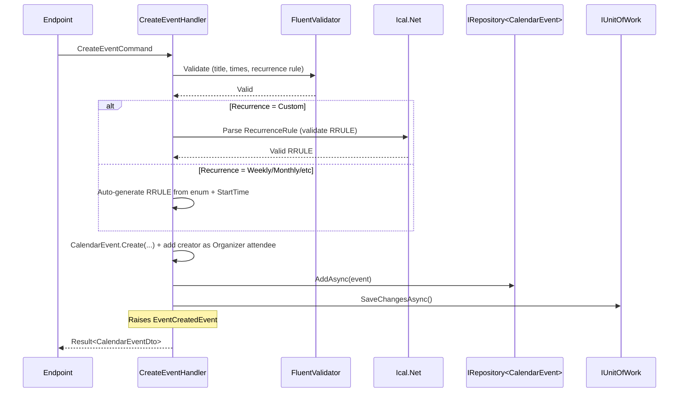
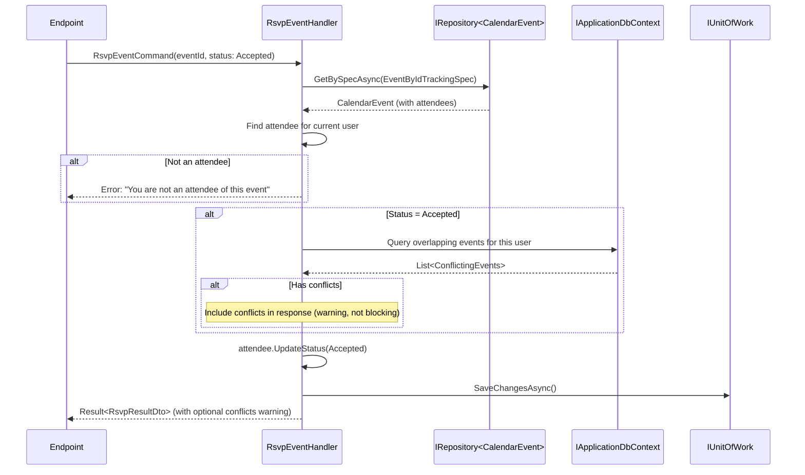

# Module: Calendar & Meeting

> Priority: **Phase 4** (after PM). Complexity: Medium. Depends on: None (standalone, but integrates with HR/PM/CRM).
>
> Scope: Calendar events, recurring events, attendee RSVP, month/week/day views, read-only overlays from other modules. **No Google Calendar sync, no external iCal import/export, no meeting rooms/resource booking, no multiple calendars per user.** Single calendar per tenant with overlays.

---

## Why This Module

Shared calendar ties together leave (HR), task due dates (PM), deal meetings (CRM), and team events. Small scope but high integration value. Standalone module — no dependency on other modules, but enriched by them.

**Strategy**: Other modules push events to Calendar via domain events (not polling). Calendar stores all events in `CalendarEvent` with a `Source` field indicating origin. Source events are read-only in Calendar UI.

---

## Entities

```
CalendarEvent (TenantAggregateRoot<Guid>)
├── Id
├── Title (string, required, max 200)
├── Description (string?, rich text, nullable)
├── StartTime (DateTime, required, stored as UTC)
├── EndTime (DateTime, required, stored as UTC)
├── IsAllDay (bool, default false)
├── TimeZoneId (string, max 50, e.g. "Asia/Ho_Chi_Minh" — IANA timezone)
├── Location (string?, max 500, nullable — text address or URL for virtual)
├── Recurrence (EventRecurrence enum, default None)
├── RecurrenceRule (string?, nullable — iCal RRULE format, e.g. "FREQ=WEEKLY;BYDAY=MO,WE,FR")
├── RecurrenceEndDate (DateTime?, nullable — when recurrence stops)
├── CreatedById (FK → User, required — event organizer)
├── Color (string?, hex, max 7, e.g. "#3B82F6")
├── RemindBefore (int?, nullable — minutes: 5/10/15/30/60/1440)
├── Visibility (EventVisibility enum, default Team)
├── Source (EventSource enum, default Manual)
├── SourceEntityId (Guid?, nullable — FK to source entity, e.g. LeadId, TaskId)
├── TenantId
├── Attendees[] (ICollection<EventAttendee>)
├── Exceptions[] (ICollection<RecurrenceException>)
├── Creator (navigation → User)
└── DomainEvents[] (ICollection<IDomainEvent>)

EventAttendee (TenantEntity<Guid>)
├── Id
├── EventId (FK → CalendarEvent, required)
├── UserId (FK → User, required)
├── Status (AttendeeStatus enum, default Pending)
├── IsOrganizer (bool, default false)
├── RespondedAt (DateTime?, nullable — set when RSVP)
├── TenantId
├── Event (navigation)
└── User (navigation)

RecurrenceException (TenantEntity<Guid>)
├── Id
├── EventId (FK → CalendarEvent, required — the recurring series)
├── OriginalDate (DateOnly, required — which occurrence is modified/deleted)
├── IsDeleted (bool, default false — true = this occurrence is cancelled)
├── OverrideTitle (string?, nullable — override title for this occurrence)
├── OverrideStartTime (DateTime?, nullable — override start time)
├── OverrideEndTime (DateTime?, nullable — override end time)
├── OverrideLocation (string?, nullable — override location)
├── OverrideDescription (string?, nullable — override description)
├── TenantId
└── Event (navigation)
```

---

### Unique Constraints (CLAUDE.md Rule 18)

| Entity | Columns | Type | Notes |
|--------|---------|------|-------|
| EventAttendee | TenantId + EventId + UserId | Unique index | One attendance record per user per event |
| RecurrenceException | TenantId + EventId + OriginalDate | Unique index | One exception per occurrence date |

---

## Enums

```csharp
public enum EventRecurrence
{
    None,       // One-time event (default)
    Daily,      // Every day
    Weekly,     // Every week (same day(s))
    Monthly,    // Every month (same date or day-of-week)
    Yearly,     // Every year (same date)
    Custom      // Complex rule defined in RecurrenceRule (RRULE)
}
// Rationale: 5 common patterns + Custom for edge cases. None = default. Custom uses RRULE for full iCal spec.

public enum EventVisibility
{
    Private,    // Only organizer and attendees can see
    Team,       // All tenant users can see (default)
    Public      // Visible to all (future: cross-tenant)
}
// Rationale: Matches HR/PM visibility model. Team is safe default.

public enum AttendeeStatus
{
    Pending,    // Not yet responded (default)
    Accepted,   // Will attend
    Declined,   // Will not attend
    Tentative   // May attend
}
// Rationale: Standard 4-state RSVP model per iCal spec.

public enum EventSource
{
    Manual,     // User-created event (default)
    Leave,      // HR approved leave (auto-created)
    TaskDue,    // PM task due date (auto-created)
    CrmMeeting  // CRM activity meeting (auto-created)
}
// Rationale: Identifies origin. Source != Manual → read-only in Calendar UI.
```

---

## Recurrence Model

### Library: Ical.Net (NuGet)

Used for RRULE parsing and occurrence expansion. **Not stored in DB** — only the RRULE string is stored. Occurrences are expanded at query time.

### Occurrence Expansion Algorithm

```
1. Query CalendarEvents where StartTime falls in date range OR has Recurrence != None
2. For non-recurring events: return as-is if within range
3. For recurring events:
   a. Parse RecurrenceRule with Ical.Net
   b. Generate occurrences within query date range
   c. Apply RecurrenceExceptions (skip deleted, apply overrides)
   d. Return expanded occurrence list
4. Sort all events by StartTime
```

### Edit Recurring Event — Three Options

| Option | Implementation |
|--------|---------------|
| **This occurrence** | Create `RecurrenceException` with `OriginalDate` + override fields |
| **This and future** | Update original event's `RecurrenceEndDate` to occurrence date - 1. Create new recurring event starting from occurrence date. |
| **All occurrences** | Update the original `CalendarEvent` directly |

### Delete Recurring Event — Three Options

| Option | Implementation |
|--------|---------------|
| **This occurrence** | Create `RecurrenceException` with `IsDeleted = true` |
| **This and future** | Update `RecurrenceEndDate` to occurrence date - 1 |
| **All occurrences** | Soft delete the original `CalendarEvent` |

---

## Features (Commands + Queries)

### Event Management

| Command/Query | Audit | Description |
|---------------|-------|-------------|
| `CreateEventCommand` | Yes | Create one-time or recurring event. Add creator as organizer attendee. |
| `UpdateEventCommand` | Yes | Update event (this occurrence / all / future). See recurrence model. |
| `DeleteEventCommand` | Yes | Delete event (this / all / future occurrences). See recurrence model. |
| `RsvpEventCommand` | Yes | Accept/Decline/Tentative for current user. Sets RespondedAt. |
| `GetEventsQuery` | No | Events for date range with occurrence expansion. Filter by user/source/visibility. |
| `GetEventByIdQuery` | No | Full event detail with attendees and recurrence info. |

### Calendar Views

| Query | Description |
|-------|-------------|
| `GetMonthViewQuery` | All events for a month. Returns compact event list (title, time, color, source). |
| `GetWeekViewQuery` | All events for a week. Returns events with time slots for grid display. |
| `GetDayViewQuery` | Detailed day view with hour-by-hour slots. |
| `GetAgendaQuery` | Upcoming events list (next 7 or 30 days). Flat chronological list. |
| `CheckConflictsQuery` | Find time conflicts for a set of attendees in a date range. |

### Reminder Management

| Command/Query | Description |
|---------------|-------------|
| `ProcessEventRemindersJob` | ITenantJobRunner — runs every 1 minute. Finds events where `StartTime - RemindBefore` ≤ now. Sends notification via existing Notification module. |

---

## DTOs (Response Shapes)

```csharp
// === Event DTOs ===

public sealed record CalendarEventDto(
    Guid Id,
    string Title,
    string? Description,
    DateTime StartTime,
    DateTime EndTime,
    bool IsAllDay,
    string TimeZoneId,
    string? Location,
    EventRecurrence Recurrence,
    string? RecurrenceRule,
    DateTime? RecurrenceEndDate,
    string CreatedById,
    string CreatorName,
    string? Color,
    int? RemindBefore,
    EventVisibility Visibility,
    EventSource Source,
    Guid? SourceEntityId,
    List<EventAttendeeDto> Attendees,
    bool IsRecurringInstance,      // True if this is an expanded occurrence (not the series itself)
    DateOnly? OccurrenceDate,      // The date of this specific occurrence (for recurring events)
    DateTime CreatedAt,
    DateTime? ModifiedAt);

public sealed record CalendarEventListDto(
    Guid Id,
    string Title,
    DateTime StartTime,
    DateTime EndTime,
    bool IsAllDay,
    string? Color,
    EventSource Source,
    EventRecurrence Recurrence,
    bool IsRecurringInstance,
    DateOnly? OccurrenceDate,
    int AttendeeCount,
    AttendeeStatus? CurrentUserStatus);  // Current user's RSVP status (null if not attendee)

public sealed record EventAttendeeDto(
    Guid Id,
    string UserId,
    string UserName,
    string? UserAvatarUrl,
    AttendeeStatus Status,
    bool IsOrganizer,
    DateTime? RespondedAt);

// === View DTOs ===

public sealed record MonthViewDto(
    int Year,
    int Month,
    List<CalendarEventListDto> Events);

public sealed record WeekViewDto(
    DateOnly WeekStart,
    DateOnly WeekEnd,
    List<DayEventsDto> Days);

public sealed record DayEventsDto(
    DateOnly Date,
    bool IsToday,
    List<CalendarEventListDto> Events);

public sealed record DayViewDto(
    DateOnly Date,
    List<HourSlotDto> Slots);

public sealed record HourSlotDto(
    int Hour,
    List<CalendarEventListDto> Events);

public sealed record AgendaDto(
    List<AgendaGroupDto> Groups);

public sealed record AgendaGroupDto(
    DateOnly Date,
    string DayLabel,        // "Today", "Tomorrow", "Monday, Mar 3"
    List<CalendarEventListDto> Events);

public sealed record ConflictDto(
    string UserId,
    string UserName,
    List<CalendarEventListDto> ConflictingEvents);

// === Request DTOs ===

public sealed record CreateEventRequest(
    string Title,
    string? Description,
    DateTime StartTime,
    DateTime EndTime,
    bool IsAllDay,
    string? TimeZoneId,
    string? Location,
    EventRecurrence Recurrence,
    string? RecurrenceRule,
    DateTime? RecurrenceEndDate,
    string? Color,
    int? RemindBefore,
    EventVisibility? Visibility,
    List<string>? AttendeeUserIds);

public sealed record UpdateEventRequest(
    string Title,
    string? Description,
    DateTime StartTime,
    DateTime EndTime,
    bool IsAllDay,
    string? TimeZoneId,
    string? Location,
    string? Color,
    int? RemindBefore,
    EventVisibility? Visibility,
    List<string>? AttendeeUserIds);

public sealed record UpdateRecurringEventRequest(
    UpdateEventRequest Event,
    RecurringEditScope Scope,     // ThisOccurrence / ThisAndFuture / AllOccurrences
    DateOnly OccurrenceDate);     // Which occurrence is being edited

public sealed record DeleteRecurringEventRequest(
    RecurringEditScope Scope,
    DateOnly OccurrenceDate);

public sealed record RsvpRequest(
    AttendeeStatus Status);

// Scope enum for recurring event operations
public enum RecurringEditScope
{
    ThisOccurrence,
    ThisAndFuture,
    AllOccurrences
}
```

---

## Validation Rules

### Event Validation

| Field | Rule |
|-------|------|
| Title | Required, 1-200 chars |
| Description | Max 10,000 chars (rich text) |
| StartTime | Required. For non-all-day events, must be valid DateTime. |
| EndTime | Required. Must be > StartTime. Max duration: 30 days for single events. |
| IsAllDay | If true, StartTime/EndTime are date-only (time portion ignored). EndTime = StartDate + 1 day for single-day. |
| TimeZoneId | If provided, must be valid IANA timezone. Default: tenant's configured timezone or "Asia/Ho_Chi_Minh". |
| Location | Max 500 chars |
| Recurrence | Valid enum value. If != None and != Custom, RecurrenceRule is auto-generated. |
| RecurrenceRule | Required when Recurrence = Custom. Must be valid iCal RRULE string (validated via Ical.Net). |
| RecurrenceEndDate | Optional. If provided, must be > StartTime. Required if recurrence has no COUNT. |
| Color | If provided, valid hex format (#RRGGBB) |
| RemindBefore | If provided, must be one of: 5, 10, 15, 30, 60, 1440 (1 day) |
| Visibility | Valid enum value, default Team |
| AttendeeUserIds | If provided, all must be valid User IDs in same tenant |

### Source Event Validation

| Rule | Details |
|------|---------|
| Source != Manual events are read-only | Cannot update/delete source events from Calendar. Must modify in source module. |
| Source events have no attendees | Integration events don't support RSVP. |
| Source events ignore Visibility | Shown based on source module's access rules. |

### Conflict Detection

| Rule | Details |
|------|---------|
| Time overlap | Two events conflict if their time ranges overlap: `A.Start < B.End AND A.End > B.Start` |
| All-day events | All-day events conflict with any event on the same date |
| Only check non-declined | Declined attendees are excluded from conflict check |

---

## Edge Cases

### 1. All-Day Event Handling

All-day events store StartTime = date at 00:00 UTC, EndTime = next date at 00:00 UTC. Multi-day all-day events span multiple days.

```
Single all-day: Start = 2026-03-01T00:00Z, End = 2026-03-02T00:00Z
Three-day: Start = 2026-03-01T00:00Z, End = 2026-03-04T00:00Z
```

Frontend renders these as banners spanning the full day(s) in calendar grid.

### 2. Timezone Display

Events stored in UTC. Displayed in viewer's timezone (from browser `Intl.DateTimeFormat().resolvedOptions().timeZone`). The `TimeZoneId` field stores the organizer's timezone for reference.

```
Created in Ho Chi Minh (UTC+7): "Meeting at 2pm" → stored as 07:00 UTC
Viewed in Tokyo (UTC+9): displayed as "4pm"
```

### 3. Recurring Event with No End

If `RecurrenceEndDate` is null and RRULE has no COUNT, occurrence expansion is capped at query range + 1 year maximum. Frontend shows "Repeats forever" indicator.

### 4. Editing Single Occurrence of Recurring Event

```
User edits "Team Standup" on March 5 (from weekly series):
→ Creates RecurrenceException(EventId, OriginalDate: 2026-03-05, OverrideTitle: "Extended Standup", OverrideEndTime: +30min)
→ All other occurrences unchanged
```

### 5. Source Event Modification

When a PM task's due date changes, Calendar receives `TaskDueDateChangedEvent`:
- Find existing CalendarEvent where `Source = TaskDue` and `SourceEntityId = taskId`
- Update StartTime/EndTime to new due date
- If task deleted, soft-delete the CalendarEvent

Source events display "(Auto)" badge in UI. Click navigates to source entity.

### 6. Attendee Removed After RSVP

If a user is removed from attendee list after accepting:
- Soft-delete the `EventAttendee` record
- Their RSVP history is preserved (for audit)
- They no longer see the event (unless Visibility = Team)

### 7. Organizer Cannot Decline

The organizer (IsOrganizer = true) cannot change their status from Accepted. They must cancel the event instead.
```
Error: "Event organizer cannot decline. Cancel the event instead."
```

---

## Sequence Diagrams

### Create Recurring Event



### RSVP with Conflict Check



---

## Specifications

```csharp
// Event specs
EventByIdSpec                    // TagWith("EventById") — detail with attendees, exceptions
EventByIdTrackingSpec            // TagWith("EventByIdTracking") — for mutations
EventsInDateRangeSpec            // TagWith("EventsInDateRange") — for calendar views, includes recurring
EventsByUserSpec                 // TagWith("EventsByUser") — events where user is attendee
EventsBySourceSpec               // TagWith("EventsBySource") — filter by Source + SourceEntityId
UpcomingEventsSpec               // TagWith("UpcomingEvents") — for agenda view (next N days)
EventsForConflictCheckSpec       // TagWith("EventsForConflictCheck") — overlapping time range for attendees
EventsNeedingReminderSpec        // TagWith("EventsNeedingReminder") — StartTime - RemindBefore <= now, not yet notified
RecurringEventsInRangeSpec       // TagWith("RecurringEventsInRange") — events with Recurrence != None that may have occurrences in range
```

---

## Frontend Pages

| Route | Page | URL State |
|-------|------|-----------|
| `/portal/calendar` | Calendar | `useUrlTab({ defaultTab: 'month' })` + `?date=2026-03-01` for navigation |
| `/portal/calendar?tab=month` | Month view | Default tab |
| `/portal/calendar?tab=week` | Week view | |
| `/portal/calendar?tab=day` | Day view | |
| `/portal/calendar?tab=agenda` | Agenda list | Upcoming events |

### Key UI Components

| Component | Library | Description |
|-----------|---------|-------------|
| **CalendarGrid** | `@schedule-x/react` + `@schedule-x/theme-shadcn` | Month/Week/Day views with shadcn styling |
| **EventPopover** | Custom (Credenza or Popover) | Quick view on event click: title, time, location, attendees, RSVP |
| **EventForm** | Credenza dialog | Create/edit with recurrence picker, attendee selector, color picker |
| **MiniCalendar** | Custom | Small month calendar in sidebar for date navigation |
| **AgendaList** | Custom | Chronological event list grouped by day |
| **RecurrenceEditDialog** | Credenza | "Edit this occurrence / all / future" choice dialog |
| **AttendeeList** | Custom | Avatars with RSVP status badges |
| **EventSourceBadge** | Badge | Shows source icon: manual (calendar), leave (palm-tree), task (check-square), meeting (phone) |

### Library: Schedule-X

**Why Schedule-X over react-big-calendar:**

| Criteria | Schedule-X | react-big-calendar |
|----------|------------|-------------------|
| Bundle size | ~15 KB | ~45 KB |
| Styling | shadcn theme plugin | CSS overrides needed |
| TypeScript | First-class | @types package |
| Maintenance | Active (2024+) | Slower updates |
| Customization | Plugin-based | Props-based |

**Packages**: `@schedule-x/react`, `@schedule-x/theme-shadcn`, `@schedule-x/event-modal`

### Design Rules (from CLAUDE.md)

- All interactive elements: `cursor-pointer`
- All icon-only buttons: `aria-label={contextual description}`
- Empty states: `<EmptyState icon={CalendarDays} title={t('...')} description={t('...')} />`
- Dialogs: `Credenza` (not AlertDialog)
- Destructive actions: confirmation dialog required
- Create event dialog: `useUrlDialog({ paramValue: 'create-event' })`
- Source event badges: color-coded by source (Manual=blue, Leave=orange, TaskDue=purple, CrmMeeting=green)

### Color Legend for Source Overlays

| Source | Color | Icon |
|--------|-------|------|
| Manual events | User-chosen color | `Calendar` |
| HR Leave | `#F97316` (orange) | `PalmTree` |
| PM Task Due | `#8B5CF6` (purple) | `CheckSquare` |
| CRM Meeting | `#10B981` (green) | `Phone` |

---

## Integration Points

| Module | Integration | Direction | Mechanism |
|--------|-------------|-----------|-----------|
| **HR Leave** | Approved leave creates CalendarEvent (Source=Leave) | HR → Calendar | Domain event: `LeaveApprovedEvent` → `CreateCalendarEventHandler` |
| **PM Tasks** | Task due date creates CalendarEvent (Source=TaskDue) | PM → Calendar | Domain event: `TaskCreatedEvent` / `TaskDueDateChangedEvent` |
| **CRM Activities** | Meeting-type activity creates CalendarEvent (Source=CrmMeeting) | CRM → Calendar | Domain event: `CrmActivityCreatedEvent` |
| **Notifications** | Event reminders via Notification module | Calendar → Notifications | `ProcessEventRemindersJob` triggers notification |
| **Activity Timeline** | Event CRUD logged via IAuditableCommand | Calendar → Audit | Automatic via audit infrastructure |
| **Webhooks** | `event.created`, `event.updated`, `event.deleted` | Calendar → Webhooks | Webhook event registry |
| **Dashboard** | Upcoming events widget (next 7 days count) | Calendar → Dashboard | Query: `GetUpcomingEventsCountQuery` |

### Source Event Lifecycle

```
Source module creates/updates/deletes entity
  → Domain event dispatched
  → Calendar event handler creates/updates/soft-deletes CalendarEvent
  → CalendarEvent.Source = {Leave|TaskDue|CrmMeeting}
  → CalendarEvent.SourceEntityId = source entity's Id
  → Calendar UI: shows as read-only with source badge
  → Click on source event → navigates to source entity
```

---

## Module Definition

```csharp
// Application/Modules/ModuleNames.cs
public static class ModuleNames
{
    public const string Calendar = "Calendar";
}

// Application/Modules/CalendarModuleDefinition.cs
public sealed class CalendarModuleDefinition : IModuleDefinition, ISingletonService
{
    public string Name => ModuleNames.Calendar;
    public string DisplayNameKey => "modules.calendar";
    public string DescriptionKey => "modules.calendar.description";
    public string Icon => "CalendarDays";
    public int SortOrder => 400;
    public bool IsCore => false;
    public bool DefaultEnabled => true;

    public IReadOnlyList<FeatureDefinition> Features =>
    [
        new(ModuleNames.Calendar + ".Events", "modules.calendar.events", "modules.calendar.events.description"),
    ];
}
```

### Permissions

| Permission | Constant | Description |
|------------|----------|-------------|
| `calendar:events:read` | `CalendarEventsRead` | View events on calendar |
| `calendar:events:create` | `CalendarEventsCreate` | Create new events |
| `calendar:events:update` | `CalendarEventsUpdate` | Update own events |
| `calendar:events:manage` | `CalendarEventsManage` | Update/delete any event, manage attendees |

### Endpoint Group

```csharp
// Endpoints/CalendarEndpoints.cs
var calendar = app.MapGroup("/api/calendar/events")
    .WithTags("Calendar - Events")
    .RequireFeature(ModuleNames.Calendar + ".Events")
    .RequireAuthorization();
```

---

## Seed Data

No seed data needed for Calendar module. Events are user-created or auto-created from integrations.

---

## EF Configuration Notes

```csharp
// CalendarEventConfiguration.cs
builder.ToTable("CalendarEvents");
builder.Property(e => e.Title).HasMaxLength(200).IsRequired();
builder.Property(e => e.TimeZoneId).HasMaxLength(50);
builder.Property(e => e.Location).HasMaxLength(500);
builder.Property(e => e.RecurrenceRule).HasMaxLength(500);
builder.Property(e => e.Color).HasMaxLength(7);
builder.Property(e => e.Recurrence).HasConversion<string>().HasMaxLength(20);
builder.Property(e => e.Visibility).HasConversion<string>().HasMaxLength(20);
builder.Property(e => e.Source).HasConversion<string>().HasMaxLength(20);
builder.HasOne(e => e.Creator).WithMany().HasForeignKey(e => e.CreatedById).OnDelete(DeleteBehavior.Restrict);
// Composite index for date range queries (primary query pattern)
builder.HasIndex(e => new { e.TenantId, e.StartTime, e.EndTime });
// Index for source lookup (find calendar event by source entity)
builder.HasIndex(e => new { e.TenantId, e.Source, e.SourceEntityId })
    .HasFilter("[SourceEntityId] IS NOT NULL");
// Index for recurring event expansion
builder.HasIndex(e => new { e.TenantId, e.Recurrence })
    .HasFilter("[Recurrence] <> 'None'");
// Index for reminder job
builder.HasIndex(e => new { e.TenantId, e.StartTime, e.RemindBefore })
    .HasFilter("[RemindBefore] IS NOT NULL");

// EventAttendeeConfiguration.cs
builder.HasIndex(e => new { e.TenantId, e.EventId, e.UserId }).IsUnique();
builder.Property(e => e.Status).HasConversion<string>().HasMaxLength(20);
builder.HasOne(e => e.Event).WithMany(e => e.Attendees).HasForeignKey(e => e.EventId).OnDelete(DeleteBehavior.Cascade);
builder.HasOne(e => e.User).WithMany().HasForeignKey(e => e.UserId).OnDelete(DeleteBehavior.Restrict);

// RecurrenceExceptionConfiguration.cs
builder.HasIndex(e => new { e.TenantId, e.EventId, e.OriginalDate }).IsUnique();
builder.Property(e => e.OverrideTitle).HasMaxLength(200);
builder.Property(e => e.OverrideLocation).HasMaxLength(500);
builder.HasOne(e => e.Event).WithMany(e => e.Exceptions).HasForeignKey(e => e.EventId).OnDelete(DeleteBehavior.Cascade);
```

**FK note**: `EventAttendee` and `RecurrenceException` use `Cascade` delete (not Restrict) because they are owned by CalendarEvent — deleting the event should clean up attendees and exceptions.

---

## Localization Keys

### English (`public/locales/en/common.json`)

```json
{
  "calendar": {
    "title": "Calendar",
    "createEvent": "Create Event",
    "editEvent": "Edit Event",
    "deleteEvent": "Delete Event",
    "eventDetails": "Event Details",
    "searchPlaceholder": "Search events...",
    "noEventsFound": "No events found",
    "noEventsDescription": "Create your first event or switch to a different date range",
    "views": {
      "month": "Month",
      "week": "Week",
      "day": "Day",
      "agenda": "Agenda"
    },
    "fields": {
      "title": "Title",
      "description": "Description",
      "startTime": "Start Time",
      "endTime": "End Time",
      "allDay": "All Day",
      "location": "Location",
      "recurrence": "Recurrence",
      "reminder": "Reminder",
      "visibility": "Visibility",
      "attendees": "Attendees",
      "color": "Color"
    },
    "recurrence": {
      "none": "Does not repeat",
      "daily": "Daily",
      "weekly": "Weekly",
      "monthly": "Monthly",
      "yearly": "Yearly",
      "custom": "Custom...",
      "editScope": "Edit Recurring Event",
      "deleteScope": "Delete Recurring Event",
      "thisOccurrence": "This occurrence",
      "thisAndFuture": "This and future occurrences",
      "allOccurrences": "All occurrences"
    },
    "rsvp": {
      "pending": "Pending",
      "accepted": "Accepted",
      "declined": "Declined",
      "tentative": "Tentative",
      "accept": "Accept",
      "decline": "Decline",
      "maybe": "Maybe"
    },
    "reminders": {
      "none": "No reminder",
      "5min": "5 minutes before",
      "10min": "10 minutes before",
      "15min": "15 minutes before",
      "30min": "30 minutes before",
      "1hour": "1 hour before",
      "1day": "1 day before"
    },
    "visibility": {
      "private": "Private",
      "team": "Team",
      "public": "Public"
    },
    "source": {
      "manual": "Manual",
      "leave": "Leave",
      "taskDue": "Task Due",
      "crmMeeting": "CRM Meeting",
      "autoCreated": "(Auto)"
    },
    "today": "Today",
    "tomorrow": "Tomorrow",
    "conflicts": "Time Conflicts",
    "conflictWarning": "This event conflicts with {count} existing event(s)"
  }
}
```

### Vietnamese (`public/locales/vi/common.json`)

```json
{
  "calendar": {
    "title": "Lịch",
    "createEvent": "Tạo sự kiện",
    "editEvent": "Sửa sự kiện",
    "deleteEvent": "Xóa sự kiện",
    "eventDetails": "Chi tiết sự kiện",
    "searchPlaceholder": "Tìm sự kiện...",
    "noEventsFound": "Không tìm thấy sự kiện",
    "noEventsDescription": "Tạo sự kiện đầu tiên hoặc chuyển sang khoảng thời gian khác",
    "views": {
      "month": "Tháng",
      "week": "Tuần",
      "day": "Ngày",
      "agenda": "Lịch trình"
    },
    "fields": {
      "title": "Tiêu đề",
      "description": "Mô tả",
      "startTime": "Thời gian bắt đầu",
      "endTime": "Thời gian kết thúc",
      "allDay": "Cả ngày",
      "location": "Địa điểm",
      "recurrence": "Lặp lại",
      "reminder": "Nhắc nhở",
      "visibility": "Hiển thị",
      "attendees": "Người tham dự",
      "color": "Màu sắc"
    },
    "recurrence": {
      "none": "Không lặp lại",
      "daily": "Hàng ngày",
      "weekly": "Hàng tuần",
      "monthly": "Hàng tháng",
      "yearly": "Hàng năm",
      "custom": "Tùy chỉnh...",
      "editScope": "Sửa sự kiện lặp lại",
      "deleteScope": "Xóa sự kiện lặp lại",
      "thisOccurrence": "Chỉ lần này",
      "thisAndFuture": "Lần này và sau đó",
      "allOccurrences": "Tất cả"
    },
    "rsvp": {
      "pending": "Chờ phản hồi",
      "accepted": "Tham gia",
      "declined": "Từ chối",
      "tentative": "Có thể",
      "accept": "Chấp nhận",
      "decline": "Từ chối",
      "maybe": "Có thể"
    },
    "reminders": {
      "none": "Không nhắc",
      "5min": "5 phút trước",
      "10min": "10 phút trước",
      "15min": "15 phút trước",
      "30min": "30 phút trước",
      "1hour": "1 giờ trước",
      "1day": "1 ngày trước"
    },
    "visibility": {
      "private": "Riêng tư",
      "team": "Nhóm",
      "public": "Công khai"
    },
    "source": {
      "manual": "Thủ công",
      "leave": "Nghỉ phép",
      "taskDue": "Hạn công việc",
      "crmMeeting": "Cuộc họp CRM",
      "autoCreated": "(Tự động)"
    },
    "today": "Hôm nay",
    "tomorrow": "Ngày mai",
    "conflicts": "Xung đột thời gian",
    "conflictWarning": "Sự kiện này xung đột với {count} sự kiện khác"
  }
}
```

---

## Phased Implementation

### Phase 1 — MVP (Calendar + One-time Events)

```
Backend:
├── Domain/Entities/Calendar/
│   ├── CalendarEvent.cs
│   └── EventAttendee.cs
├── Domain/Enums/
│   ├── EventRecurrence.cs
│   ├── EventVisibility.cs
│   ├── AttendeeStatus.cs
│   └── EventSource.cs
├── Domain/Events/
│   ├── EventCreatedEvent.cs
│   ├── EventUpdatedEvent.cs
│   └── EventDeletedEvent.cs
├── Application/Features/Calendar/
│   ├── Commands/
│   │   ├── CreateEvent/
│   │   ├── UpdateEvent/
│   │   ├── DeleteEvent/
│   │   └── RsvpEvent/
│   ├── Queries/
│   │   ├── GetEvents/
│   │   ├── GetEventById/
│   │   ├── GetMonthView/
│   │   ├── GetWeekView/
│   │   ├── GetDayView/
│   │   ├── GetAgenda/
│   │   └── CheckConflicts/
│   ├── DTOs/
│   │   └── CalendarDtos.cs
│   └── Specifications/
│       └── CalendarSpecs.cs
├── Application/Modules/
│   └── CalendarModuleDefinition.cs
├── Infrastructure/Persistence/
│   ├── Configurations/
│   │   ├── CalendarEventConfiguration.cs
│   │   └── EventAttendeeConfiguration.cs
│   └── Repositories/
│       └── CalendarEventRepository.cs
├── Endpoints/
│   └── CalendarEndpoints.cs
└── Tests:
    ├── Domain.UnitTests/Entities/Calendar/
    ├── Application.UnitTests/Features/Calendar/
    └── ArchitectureTests/ (update permission count)

Frontend:
├── portal-app/calendar/
│   ├── features/
│   │   ├── calendar-view/
│   │   │   └── CalendarPage.tsx
│   │   └── event-detail/
│   │       └── EventDetailPage.tsx (or slide-over)
│   ├── components/
│   │   ├── CalendarGrid.tsx (Schedule-X wrapper)
│   │   ├── EventPopover.tsx
│   │   ├── EventForm.tsx (Credenza dialog)
│   │   ├── MiniCalendar.tsx
│   │   ├── AgendaList.tsx
│   │   ├── AttendeeList.tsx
│   │   └── EventSourceBadge.tsx
│   ├── queries/
│   │   ├── queryKeys.ts
│   │   ├── useCalendarQueries.ts
│   │   └── useCalendarMutations.ts
│   └── index.ts
├── services/
│   └── calendar.ts
├── types/
│   └── calendar.ts
├── Sidebar: Calendar section (feature-gated)
└── i18n: EN + VI under "calendar" namespace

NOTE: Phase 1 MVP — No recurrence. All events are one-time only.
      Recurrence = None for all events. RecurrenceRule ignored.
```

### Phase 2 — Recurrence + Integration

```
├── Domain/Entities/Calendar/RecurrenceException.cs
├── Application/Features/Calendar/
│   ├── Commands/UpdateRecurringEvent/
│   ├── Commands/DeleteRecurringEvent/
│   └── Services/IRecurrenceExpander.cs
├── Infrastructure/Services/RecurrenceExpander.cs (uses Ical.Net)
├── Infrastructure/Configurations/RecurrenceExceptionConfiguration.cs
├── Integration event handlers:
│   ├── LeaveApprovedEventHandler → creates Source=Leave event
│   ├── TaskCreatedEventHandler → creates Source=TaskDue event
│   └── CrmActivityCreatedEventHandler → creates Source=CrmMeeting event
├── Frontend: RecurrenceEditDialog, source event badges, recurrence picker
├── NuGet: Ical.Net package
└── Tests: Recurrence expansion, integration handlers, exception handling
```

### Phase 3 — Advanced

```
├── ProcessEventRemindersJob (ITenantJobRunner, 1-min interval)
├── Multiple calendars: Personal + Team + Shared
├── External sync: iCal export (.ics file generation)
├── Conflict auto-detection on event creation
└── Dashboard widget: Upcoming events count
```

---

## Architecture Notes

### Occurrence Expansion Service

```csharp
public interface IRecurrenceExpander
{
    /// <summary>
    /// Expand a recurring event into individual occurrences within a date range.
    /// Applies RecurrenceExceptions (deletions and overrides).
    /// </summary>
    List<CalendarEventListDto> ExpandOccurrences(
        CalendarEvent recurringEvent,
        DateTime rangeStart,
        DateTime rangeEnd);
}
```

Implementation uses `Ical.Net.CalendarComponents.CalendarEvent` internally for RRULE parsing. Capped at 365 occurrences per expansion to prevent memory issues.

### Reminder Job Pattern

```csharp
// Infrastructure/Jobs/ProcessEventRemindersJob.cs
// Runs every 1 minute via ITenantJobRunner
// For each tenant:
//   1. Query events where (StartTime - RemindBefore minutes) <= now AND not yet reminded
//   2. For each event, send notification to all attendees with Status != Declined
//   3. Mark event as reminded (using a ReminderSentAt field or separate tracking)
```

Uses existing `INotificationService` for delivery. Notification type: `EventReminder`.

### TimeZone Handling

- All `DateTime` values stored as UTC in database
- `TimeZoneId` stores IANA timezone for organizer reference (e.g., "Asia/Ho_Chi_Minh")
- Frontend converts to local timezone using browser's `Intl.DateTimeFormat`
- `TimeZoneInfo.FindSystemTimeZoneById()` for .NET timezone conversion (with IANA mapping via `TimeZoneConverter` NuGet)

---

## Migration Checklist

- [ ] `dotnet build src/NOIR.sln` — 0 errors
- [ ] `dotnet test src/NOIR.sln` — ALL pass
- [ ] `cd src/NOIR.Web/frontend && pnpm run build` — 0 errors, 0 warnings
- [ ] DI verification test for CalendarEventRepository
- [ ] Permission count updated in `All_ShouldContainAllPermissions` test
- [ ] ModuleNames.Calendar constant added
- [ ] CalendarModuleDefinition registered
- [ ] Before-state resolvers for UpdateEvent command
- [ ] Webhook events registered: `event.created`, `event.updated`, `event.deleted`
- [ ] i18n: Both EN + VI locales complete under `calendar` namespace
- [ ] UI: All interactive elements have `cursor-pointer`
- [ ] UI: All icon-only buttons have `aria-label`
- [ ] UI: Empty states use `<EmptyState />` component
- [ ] UI: All destructive actions have confirmation dialogs
- [ ] EF Migration: `AddCalendarEvents` (Phase 1), `AddRecurrenceExceptions` (Phase 2)
- [ ] NuGet: `Ical.Net` package added (Phase 2)
- [ ] npm: `@schedule-x/react`, `@schedule-x/theme-shadcn` packages added
