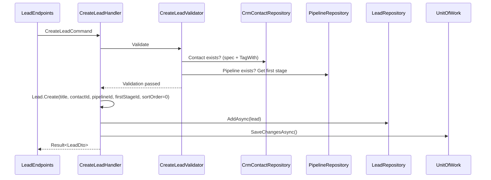
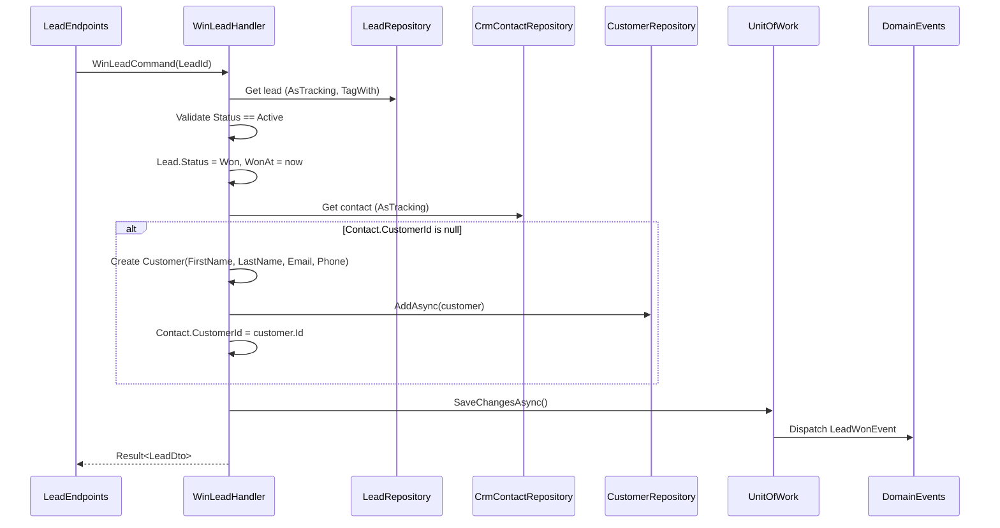

# Module: CRM (Basic)

> Priority: **Phase 2** (after HR). Complexity: Medium. Depends on: HR (Employee for ownership).
>
> Scope: Contact, Company, Lead, Pipeline Kanban, Activity Log, Dashboard widget group. **No Import/Export, no Custom Fields, no Email campaigns, no Quotation (manual order creation after deal won).** Keep it lightweight.

---

## Why This Module

Customers module (e-commerce) tracks people who **already bought**. CRM tracks people **before they buy** — who's interested, what deals are in progress.

**Strategy**: Keep Customers (e-commerce) and Contacts (CRM) as **separate entities**. When a deal is won, auto-create a Customer from the Contact.

---

## Entities

```
CrmContact (TenantAggregateRoot<Guid>)
├── Id
├── FirstName (string, required, max 100)
├── LastName (string, required, max 100)
├── Email (string, required, max 256, validated format)
├── Phone (string?, nullable, max 20)
├── JobTitle (string?, nullable, max 100)
├── CompanyId (FK → CrmCompany, nullable)
├── OwnerId (FK → Employee, nullable — who manages this contact)
├── Source (ContactSource enum)
├── CustomerId (FK → Customer, nullable — linked when deal won)
├── Notes (string?, nullable, max 2000)
├── TenantId
├── Company (navigation, nullable)
├── Owner (navigation, nullable)
├── Customer (navigation, nullable)
└── Leads[] (ICollection<Lead>)

CrmCompany (TenantAggregateRoot<Guid>)
├── Id
├── Name (string, required, max 200)
├── Domain (string?, nullable, max 100 — e.g. "acme.com")
├── Industry (string?, nullable, max 100)
├── Address (string?, nullable, max 500)
├── Phone (string?, nullable, max 20)
├── Website (string?, nullable, max 256)
├── OwnerId (FK → Employee, nullable)
├── TaxId (string?, nullable, max 50 — generic, works for any country)
├── EmployeeCount (int?, nullable)
├── Notes (string?, nullable, max 2000)
├── TenantId
├── Owner (navigation, nullable)
└── Contacts[] (ICollection<CrmContact>)

Lead (TenantAggregateRoot<Guid>)
├── Id
├── Title (string, required, max 200 — deal name)
├── ContactId (FK → CrmContact, required)
├── CompanyId (FK → CrmCompany, nullable — denormalized from Contact for convenience)
├── Value (decimal, default 0 — estimated deal value)
├── Currency (string, max 3, default from tenant settings — ISO 4217)
├── OwnerId (FK → Employee, nullable)
├── PipelineId (FK → Pipeline, required)
├── StageId (FK → PipelineStage, required)
├── Status (LeadStatus enum — Active/Won/Lost)
├── SortOrder (double — for Kanban drag ordering within stage)
├── ExpectedCloseDate (DateTimeOffset?, nullable)
├── WonAt (DateTimeOffset?, nullable)
├── LostAt (DateTimeOffset?, nullable)
├── LostReason (string?, nullable, max 500)
├── Notes (string?, nullable, max 2000)
├── TenantId
├── Contact (navigation)
├── Company (navigation, nullable)
├── Owner (navigation, nullable)
├── Pipeline (navigation)
└── Stage (navigation)

Pipeline (TenantAggregateRoot<Guid>)
├── Id
├── Name (string, required, max 100)
├── IsDefault (bool — one default per tenant)
├── TenantId
└── Stages[] (ICollection<PipelineStage>, ordered by SortOrder)

PipelineStage (TenantEntity<Guid>)
├── Id
├── PipelineId (FK → Pipeline)
├── Name (string, required, max 100)
├── SortOrder (int)
├── Color (string, max 7 — hex e.g. "#3B82F6")
└── TenantId

CrmActivity (TenantEntity<Guid>)
├── Id
├── Type (ActivityType enum — Call/Email/Meeting/Note)
├── Subject (string, required, max 200)
├── Description (string?, nullable, max 2000)
├── ContactId (FK → CrmContact, nullable — activity on a contact)
├── LeadId (FK → Lead, nullable — activity on a deal)
├── PerformedById (FK → Employee, required — who did this)
├── PerformedAt (DateTimeOffset, required — when it happened)
├── DurationMinutes (int?, nullable — for calls/meetings)
├── TenantId
├── Contact (navigation, nullable)
├── Lead (navigation, nullable)
└── PerformedBy (navigation)
```

**At least one of `ContactId` or `LeadId` must be set** (validated in handler). An activity can be linked to both (e.g., a call about a specific deal with a contact).

**6 entities. No custom fields, no merge logic, no email campaigns.** Simple.

### Unique Constraints (CLAUDE.md Rule 18)

| Entity | Constraint | Index |
|--------|-----------|-------|
| CrmContact | `Email + TenantId` | Unique |
| CrmCompany | `Name + TenantId` | Unique |
| CrmCompany | `Domain + TenantId` | Unique, filtered (`Domain IS NOT NULL`) |
| Pipeline | `Name + TenantId` | Unique |
| PipelineStage | `Name + PipelineId + TenantId` | Unique (no duplicate stage names in same pipeline) |
| CrmActivity | `ContactId + LeadId + TenantId` | Composite index (non-unique, for timeline queries) |

---

## Enums

```csharp
public enum ContactSource
{
    Web,        // Inbound via website form
    Referral,   // Referred by existing customer
    Social,     // Social media (LinkedIn, Facebook, etc.)
    Cold,       // Cold outreach (email, call)
    Event,      // Trade show, conference, meetup
    Other
}

public enum LeadStatus
{
    Active,     // In pipeline, being worked on
    Won,        // Deal closed successfully
    Lost        // Deal lost (with reason)
}

public enum ActivityType
{
    Call,       // Phone call (log duration)
    Email,     // Email sent/received
    Meeting,   // In-person or virtual meeting (log duration)
    Note       // General note / comment
}
```

---

## Features (Commands + Queries)

### Contact
| Command/Query | Description |
|---------------|-------------|
| `CreateContactCommand` | Create contact, optionally link to company |
| `UpdateContactCommand` | Update details |
| `DeleteContactCommand` | Soft delete — **blocked if contact has active leads** |
| `GetContactsQuery` | Paginated, search by name/email, filter by company/owner/source |
| `GetContactByIdQuery` | Detail with company, leads list |

### Company
| Command/Query | Description |
|---------------|-------------|
| `CreateCompanyCommand` | Create company |
| `UpdateCompanyCommand` | Update details |
| `DeleteCompanyCommand` | Soft delete — **blocked if has contacts** |
| `GetCompaniesQuery` | Paginated, search by name/domain |
| `GetCompanyByIdQuery` | Detail with contacts list |

### Lead / Deal
| Command/Query | Description |
|---------------|-------------|
| `CreateLeadCommand` | Create lead linked to contact, placed in first stage of pipeline |
| `UpdateLeadCommand` | Update title, value, dates, notes |
| `MoveLeadStageCommand` | Drag to different stage (Kanban). Only for Active leads. |
| `ReorderLeadCommand` | Change SortOrder within stage |
| `WinLeadCommand` | Mark as Won → set `Status=Won`, `WonAt=now`. Auto-create Customer if Contact.CustomerId is null. |
| `LoseLeadCommand` | Mark as Lost → set `Status=Lost`, `LostAt=now`, `LostReason`. |
| `ReopenLeadCommand` | Reopen Won/Lost lead → set `Status=Active`, clear WonAt/LostAt/LostReason, place back in last active stage. |
| `GetLeadsQuery` | Filter by pipeline/stage/owner/status |
| `GetLeadByIdQuery` | Full detail with contact, company |
| `GetPipelineViewQuery` | Stages with active leads for Kanban board. Optional `includeClosedDeals` param for toggle. |

### Pipeline
| Command/Query | Description |
|---------------|-------------|
| `CreatePipelineCommand` | Create custom pipeline with stages |
| `UpdatePipelineCommand` | Update name, add/remove/reorder stages |
| `DeletePipelineCommand` | Soft delete — **blocked if has active leads** |
| `GetPipelinesQuery` | List pipelines |

### Activity Log
| Command/Query | Description |
|---------------|-------------|
| `CreateActivityCommand` | Log an activity (call, email, meeting, note) on a contact and/or lead |
| `UpdateActivityCommand` | Update activity details |
| `DeleteActivityCommand` | Soft delete an activity |
| `GetActivitiesQuery` | Paginated timeline for a contact or lead, ordered by `PerformedAt` desc |

---

## DTOs

```csharp
// === Contact DTOs ===

public sealed record CreateContactCommand(
    string FirstName,
    string LastName,
    string Email,
    string? Phone,
    string? JobTitle,
    Guid? CompanyId,
    Guid? OwnerId,
    ContactSource Source,
    string? Notes
) : IAuditableCommand<ContactDto>;

public sealed record UpdateContactCommand(
    Guid Id,
    string FirstName,
    string LastName,
    string Email,
    string? Phone,
    string? JobTitle,
    Guid? CompanyId,
    Guid? OwnerId,
    ContactSource Source,
    string? Notes
) : IAuditableCommand<ContactDto>;

public sealed record ContactDto(
    Guid Id,
    string FirstName,
    string LastName,
    string Email,
    string? Phone,
    string? JobTitle,
    Guid? CompanyId,
    string? CompanyName,
    Guid? OwnerId,
    string? OwnerName,
    ContactSource Source,
    Guid? CustomerId,
    string? Notes,
    int LeadCount,
    DateTimeOffset CreatedAt,
    DateTimeOffset? ModifiedAt);

public sealed record ContactListDto(
    Guid Id,
    string FirstName,
    string LastName,
    string Email,
    string? Phone,
    string? JobTitle,
    string? CompanyName,
    string? OwnerName,
    ContactSource Source,
    bool HasCustomer,
    int LeadCount,
    DateTimeOffset CreatedAt);

// === Company DTOs ===

public sealed record CreateCompanyCommand(
    string Name,
    string? Domain,
    string? Industry,
    string? Address,
    string? Phone,
    string? Website,
    Guid? OwnerId,
    string? TaxId,
    int? EmployeeCount,
    string? Notes
) : IAuditableCommand<CompanyDto>;

public sealed record UpdateCompanyCommand(
    Guid Id,
    string Name,
    string? Domain,
    string? Industry,
    string? Address,
    string? Phone,
    string? Website,
    Guid? OwnerId,
    string? TaxId,
    int? EmployeeCount,
    string? Notes
) : IAuditableCommand<CompanyDto>;

public sealed record CompanyDto(
    Guid Id,
    string Name,
    string? Domain,
    string? Industry,
    string? Address,
    string? Phone,
    string? Website,
    Guid? OwnerId,
    string? OwnerName,
    string? TaxId,
    int? EmployeeCount,
    string? Notes,
    int ContactCount,
    DateTimeOffset CreatedAt,
    DateTimeOffset? ModifiedAt);

public sealed record CompanyListDto(
    Guid Id,
    string Name,
    string? Domain,
    string? Industry,
    string? OwnerName,
    int ContactCount,
    DateTimeOffset CreatedAt);

// === Lead DTOs ===

public sealed record CreateLeadCommand(
    string Title,
    Guid ContactId,
    Guid? CompanyId,
    decimal Value,
    string? Currency,
    Guid? OwnerId,
    Guid PipelineId,
    DateTimeOffset? ExpectedCloseDate,
    string? Notes
) : IAuditableCommand<LeadDto>;

public sealed record UpdateLeadCommand(
    Guid Id,
    string Title,
    decimal Value,
    string? Currency,
    Guid? OwnerId,
    DateTimeOffset? ExpectedCloseDate,
    string? Notes
) : IAuditableCommand<LeadDto>;

public sealed record MoveLeadStageCommand(
    Guid LeadId,
    Guid NewStageId,
    double NewSortOrder
) : IAuditableCommand<LeadDto>;

public sealed record WinLeadCommand(Guid LeadId) : IAuditableCommand<LeadDto>;
public sealed record LoseLeadCommand(Guid LeadId, string? Reason) : IAuditableCommand<LeadDto>;
public sealed record ReopenLeadCommand(Guid LeadId) : IAuditableCommand<LeadDto>;

public sealed record LeadDto(
    Guid Id,
    string Title,
    Guid ContactId,
    string ContactName,
    string ContactEmail,
    Guid? CompanyId,
    string? CompanyName,
    decimal Value,
    string Currency,
    Guid? OwnerId,
    string? OwnerName,
    Guid PipelineId,
    string PipelineName,
    Guid StageId,
    string StageName,
    string StageColor,
    LeadStatus Status,
    double SortOrder,
    DateTimeOffset? ExpectedCloseDate,
    DateTimeOffset? WonAt,
    DateTimeOffset? LostAt,
    string? LostReason,
    string? Notes,
    DateTimeOffset CreatedAt,
    DateTimeOffset? ModifiedAt);

public sealed record LeadCardDto(
    Guid Id,
    string Title,
    string ContactName,
    decimal Value,
    string Currency,
    string? OwnerName,
    LeadStatus Status,
    double SortOrder,
    DateTimeOffset? ExpectedCloseDate,
    DateTimeOffset CreatedAt);

// === Pipeline DTOs ===

public sealed record CreatePipelineCommand(
    string Name,
    bool IsDefault,
    List<CreatePipelineStageDto> Stages
) : IAuditableCommand<PipelineDto>;

public sealed record CreatePipelineStageDto(
    string Name,
    int SortOrder,
    string Color);

public sealed record UpdatePipelineCommand(
    Guid Id,
    string Name,
    List<UpdatePipelineStageDto> Stages
) : IAuditableCommand<PipelineDto>;

public sealed record UpdatePipelineStageDto(
    Guid? Id,        // null = new stage
    string Name,
    int SortOrder,
    string Color);

public sealed record PipelineDto(
    Guid Id,
    string Name,
    bool IsDefault,
    List<PipelineStageDto> Stages);

public sealed record PipelineStageDto(
    Guid Id,
    string Name,
    int SortOrder,
    string Color);

// === Pipeline View DTOs (Kanban) ===

public sealed record GetPipelineViewQuery(
    Guid PipelineId,
    bool IncludeClosedDeals = false);

public sealed record PipelineViewDto(
    Guid PipelineId,
    string PipelineName,
    List<StageWithLeadsDto> Stages);

public sealed record StageWithLeadsDto(
    Guid StageId,
    string StageName,
    string StageColor,
    int SortOrder,
    decimal TotalValue,
    int LeadCount,
    List<LeadCardDto> Leads);

// === Activity DTOs ===

public sealed record CreateActivityCommand(
    ActivityType Type,
    string Subject,
    string? Description,
    Guid? ContactId,
    Guid? LeadId,
    DateTimeOffset PerformedAt,
    int? DurationMinutes
) : IAuditableCommand<ActivityDto>;

public sealed record UpdateActivityCommand(
    Guid Id,
    ActivityType Type,
    string Subject,
    string? Description,
    DateTimeOffset PerformedAt,
    int? DurationMinutes
) : IAuditableCommand<ActivityDto>;

public sealed record ActivityDto(
    Guid Id,
    ActivityType Type,
    string Subject,
    string? Description,
    Guid? ContactId,
    string? ContactName,
    Guid? LeadId,
    string? LeadTitle,
    Guid PerformedById,
    string PerformedByName,
    DateTimeOffset PerformedAt,
    int? DurationMinutes,
    DateTimeOffset CreatedAt);

public sealed record GetActivitiesQuery(
    Guid? ContactId,
    Guid? LeadId,
    int Page = 1,
    int PageSize = 20);

// === Dashboard DTOs ===

public sealed record CrmDashboardDto(
    int TotalContacts,
    int TotalCompanies,
    int ActiveDeals,
    decimal TotalPipelineValue,
    int WonDealsThisMonth,
    decimal WonValueThisMonth,
    int LostDealsThisMonth,
    decimal ConversionRate);      // Won / (Won + Lost) * 100 over last 90 days
```

---

## Validation Rules

### Contact

| Field | Rule |
|-------|------|
| `FirstName` | Required, 1-100 chars |
| `LastName` | Required, 1-100 chars |
| `Email` | Required, valid email format, unique per tenant |
| `Phone` | Optional, max 20 chars |
| `JobTitle` | Optional, max 100 chars |
| `CompanyId` | If provided, must exist and belong to tenant |
| `OwnerId` | If provided, must be an active Employee in tenant |
| `Notes` | Optional, max 2000 chars |

### Company

| Field | Rule |
|-------|------|
| `Name` | Required, 1-200 chars, unique per tenant |
| `Domain` | Optional, max 100, unique per tenant (filtered where not null) |
| `Industry` | Optional, max 100 |
| `Address` | Optional, max 500 |
| `Website` | Optional, valid URL format, max 256 |
| `TaxId` | Optional, max 50 |
| `EmployeeCount` | Optional, > 0 |

### Lead

| Field | Rule |
|-------|------|
| `Title` | Required, 1-200 chars |
| `ContactId` | Required, must exist and belong to tenant |
| `PipelineId` | Required, must exist and belong to tenant |
| `Value` | >= 0 |
| `Currency` | 3 chars, ISO 4217 |
| `ExpectedCloseDate` | If provided, must be in the future (on create) |

### Pipeline

| Field | Rule |
|-------|------|
| `Name` | Required, 1-100 chars, unique per tenant |
| `Stages` | At least 1 stage required |
| `IsDefault` | Only one default per tenant — if set to true, unset previous default |

### Activity

| Field | Rule |
|-------|------|
| `Type` | Required, valid `ActivityType` enum |
| `Subject` | Required, 1-200 chars |
| `Description` | Optional, max 2000 chars |
| `ContactId` / `LeadId` | At least one must be provided. Both can be set. |
| `PerformedAt` | Required, cannot be in the future |
| `DurationMinutes` | Optional, > 0. Only relevant for Call/Meeting types. |

---

## Edge Cases

### Delete Protection

| Action | Guard | Error |
|--------|-------|-------|
| Delete CrmContact | Contact has active leads (`Status = Active`) | `"Cannot delete contact with active deals. Close or reassign deals first."` |
| Delete CrmContact | Contact has won/lost leads | Allowed (historical data soft-deleted) |
| Delete CrmCompany | Company has any contacts | `"Cannot delete company with existing contacts. Remove or reassign contacts first."` |
| Delete Pipeline | Pipeline has active leads | `"Cannot delete pipeline with active deals. Move deals to another pipeline first."` |
| Delete PipelineStage | Stage has active leads | `"Cannot delete stage with active deals. Move deals to another stage first."` |
| Delete PipelineStage | Pipeline would have 0 stages | `"Pipeline must have at least one stage."` |

### Won/Lost Lead Handling

```
WinLeadCommandHandler:
  1. Validate: Lead.Status must be Active
  2. Set Lead.Status = Won, Lead.WonAt = now
  3. Check Contact.CustomerId
     → Not null: already a Customer, skip
     → Null: create Customer from Contact data (FirstName, LastName, Email, Phone)
       → Set Contact.CustomerId = new Customer.Id
  4. Fire LeadWonEvent (for webhooks/notifications/audit)

LoseLeadCommandHandler:
  1. Validate: Lead.Status must be Active
  2. Set Lead.Status = Lost, Lead.LostAt = now, Lead.LostReason = reason
  3. Fire LeadLostEvent

ReopenLeadCommandHandler:
  1. Validate: Lead.Status must be Won or Lost
  2. Set Lead.Status = Active
  3. Clear WonAt, LostAt, LostReason
  4. If Contact.CustomerId was set by WinLead: do NOT remove Customer link (Customer already exists independently)
  5. Fire LeadReopenedEvent
```

### Kanban Won/Lost Toggle

- By default, `GetPipelineViewQuery` returns only **Active** leads on the Kanban board
- Frontend has a toggle "Show closed deals" that passes `includeClosedDeals: true`
- When toggled on: Won leads show in a "Won" column (green), Lost in a "Lost" column (red) — these are **virtual columns** not real PipelineStages
- Won/Lost leads are **not draggable** — use Reopen action to move back to Active

### Pipeline Default Enforcement

- `CreatePipelineCommand` with `IsDefault = true` → unset `IsDefault` on the previous default pipeline
- `DeletePipelineCommand` on the default pipeline → blocked: `"Cannot delete the default pipeline."`
- If no default pipeline exists (shouldn't happen), first pipeline becomes default

### Owner (Employee) Deactivation

When an Employee is deactivated (from HR module):
- Contacts/Companies/Leads assigned to that employee **keep their OwnerId** (historical record)
- Frontend shows "(Inactive)" badge next to owner name if employee is not active
- Admin can reassign ownership manually

---

## Sequence Diagrams

### Create Lead with Pipeline Placement



### Win Lead with Customer Creation



---

## Specifications (NOIR Pattern)

```csharp
// All specs include TagWith() per CLAUDE.md Rule 2

// Contact Specs
public class ContactByIdSpec : Specification<CrmContact>          // TagWith("ContactById")
public class ContactByEmailSpec : Specification<CrmContact>       // TagWith("ContactByEmail"), for uniqueness check
public class ContactsFilterSpec : Specification<CrmContact>       // TagWith("ContactsFilter"), paginated, search, filter
public class ContactHasActiveLeadsSpec : Specification<Lead>      // TagWith("ContactHasActiveLeads"), count > 0 guard

// Company Specs
public class CompanyByIdSpec : Specification<CrmCompany>          // TagWith("CompanyById")
public class CompanyByNameSpec : Specification<CrmCompany>        // TagWith("CompanyByName"), uniqueness
public class CompaniesFilterSpec : Specification<CrmCompany>      // TagWith("CompaniesFilter"), paginated
public class CompanyHasContactsSpec : Specification<CrmContact>   // TagWith("CompanyHasContacts"), count > 0 guard

// Lead Specs
public class LeadByIdSpec : Specification<Lead>                   // TagWith("LeadById")
public class LeadsFilterSpec : Specification<Lead>                // TagWith("LeadsFilter"), paginated, by pipeline/stage/owner/status
public class LeadsByPipelineSpec : Specification<Lead>            // TagWith("LeadsByPipeline"), for Kanban view
public class ActiveLeadsByPipelineSpec : Specification<Lead>      // TagWith("ActiveLeadsByPipeline"), Status == Active
public class ActiveLeadsByStageSpec : Specification<Lead>         // TagWith("ActiveLeadsByStage"), for stage delete guard

// Pipeline Specs
public class PipelineByIdSpec : Specification<Pipeline>           // TagWith("PipelineById"), includes Stages
public class PipelineByIdWithLeadsSpec : Specification<Pipeline>  // TagWith("PipelineByIdWithLeads"), AsSplitQuery
public class PipelinesListSpec : Specification<Pipeline>          // TagWith("PipelinesList")
public class DefaultPipelineSpec : Specification<Pipeline>        // TagWith("DefaultPipeline"), IsDefault == true

// Activity Specs
public class ActivitiesByContactSpec : Specification<CrmActivity> // TagWith("ActivitiesByContact"), paginated, ordered by PerformedAt desc
public class ActivitiesByLeadSpec : Specification<CrmActivity>    // TagWith("ActivitiesByLead"), paginated, ordered by PerformedAt desc
```

---

## Frontend Pages

| Route | Page | Features |
|-------|------|----------|
| `/portal/crm/contacts` | Contact list | Table, search, filter by company/owner/source, create/edit dialog |
| `/portal/crm/contacts/:id` | Contact detail | Profile, company link, leads list, **activity timeline**, link to Customer if exists |
| `/portal/crm/companies` | Company list | Table, search, create/edit dialog |
| `/portal/crm/companies/:id` | Company detail | Info, contacts list |
| `/portal/crm/pipeline` | Pipeline Kanban | Drag-and-drop leads across stages, pipeline selector, "Show closed" toggle |
| `/portal/crm/pipeline/deals/:id` | Deal detail | Lead info, contact, company, **activity timeline**, won/lost/reopen actions |

### Key UI Components

- **PipelineKanban**: Stages as columns, lead cards draggable between stages (`@dnd-kit/core` + `@dnd-kit/sortable`). Float-based SortOrder for insert-between. Optimistic updates on drag.
- **LeadCard**: Compact: title, value (formatted currency), contact name, expected close date, owner avatar
- **StageColumnHeader**: Stage name + color indicator + total value + lead count
- **WonLostColumns**: Virtual columns (not PipelineStages) shown when "Show closed deals" toggle is on. Green for Won, red for Lost. Non-draggable cards.
- **ContactForm**: Create/edit dialog with company autocomplete dropdown
- **CompanyForm**: Create/edit dialog
- **LeadStatusActions**: Win/Lose/Reopen button group on deal detail page
- **ActivityTimeline**: Chronological list of activities (icon per type, subject, description, performer, time). "Log activity" button opens `ActivityDialog`.
- **ActivityDialog**: Create/edit activity with type selector (Call/Email/Meeting/Note), subject, description, date/time picker, duration (for Call/Meeting)

### Dashboard Widget Group

Added to main dashboard as `CrmWidgetGroup` (feature-gated by `ModuleNames.Erp.Crm`):

| Widget | Content |
|--------|---------|
| **CrmOverviewCard** | Total contacts, total companies (MetricCard style) |
| **PipelineValueCard** | Active deals count, total pipeline value |
| **ConversionCard** | Won/Lost this month, 90-day conversion rate |

---

## Integration Points

| Module | Integration |
|--------|-------------|
| **Customers** | Auto-create Customer on deal won (`WinLeadCommandHandler`) |
| **HR/Employees** | Contact/Lead/Company owner = Employee. Owner badge shows "(Inactive)" for deactivated employees. |
| **Dashboard** | CRM widget group on main dashboard (feature-gated) |
| **Notifications** | Lead won/lost events |
| **Webhooks** | `lead.created`, `lead.won`, `lead.lost`, `contact.created`, `company.created` |
| **Activity Timeline** | Lead stage changes, won/lost transitions in audit log |

---

## Permissions

```csharp
public static class Crm
{
    public const string ContactsRead   = "crm:contacts:read";
    public const string ContactsCreate = "crm:contacts:create";
    public const string ContactsUpdate = "crm:contacts:update";
    public const string ContactsDelete = "crm:contacts:delete";

    public const string CompaniesRead   = "crm:companies:read";
    public const string CompaniesCreate = "crm:companies:create";
    public const string CompaniesUpdate = "crm:companies:update";
    public const string CompaniesDelete = "crm:companies:delete";

    public const string LeadsRead    = "crm:leads:read";
    public const string LeadsCreate  = "crm:leads:create";
    public const string LeadsUpdate  = "crm:leads:update";
    public const string LeadsManage  = "crm:leads:manage";    // won/lost/reopen/delete

    public const string PipelineManage = "crm:pipeline:manage"; // CRUD pipelines and stages

    public const string ActivitiesRead   = "crm:activities:read";
    public const string ActivitiesCreate = "crm:activities:create";
    public const string ActivitiesUpdate = "crm:activities:update";
    public const string ActivitiesDelete = "crm:activities:delete";
}
```

---

## Seed Data

### Default Pipeline

```csharp
// Seeded via ApplicationDbContextSeeder
new Pipeline
{
    Name = "Sales Pipeline",
    IsDefault = true,
    Stages = new[]
    {
        new PipelineStage { Name = "New",          SortOrder = 0, Color = "#6B7280" }, // gray
        new PipelineStage { Name = "Contacted",    SortOrder = 1, Color = "#3B82F6" }, // blue
        new PipelineStage { Name = "Qualified",    SortOrder = 2, Color = "#8B5CF6" }, // purple
        new PipelineStage { Name = "Proposal",     SortOrder = 3, Color = "#F59E0B" }, // amber
        new PipelineStage { Name = "Negotiation",  SortOrder = 4, Color = "#EF4444" }, // red
    }
};
// Won/Lost are NOT stages — they are LeadStatus values
```

---

## Phased Implementation

### Phase 1 — Contacts + Companies + Pipeline (Full MVP)

```
Backend:
├── Domain: CrmContact, CrmCompany, CrmActivity, Lead, Pipeline, PipelineStage
│   ├── Enums: ContactSource, LeadStatus, ActivityType
│   └── Events: LeadWonEvent, LeadLostEvent, LeadReopenedEvent
├── Application: All CRUD commands/queries/validators listed above
│   ├── DTOs: All record types above
│   ├── Specifications: 16 specs with TagWith
│   └── Handlers: 22 command/query handlers
├── Infrastructure:
│   ├── EF Configs: CrmContactConfiguration, CrmCompanyConfiguration, CrmActivityConfiguration, LeadConfiguration, PipelineConfiguration, PipelineStageConfiguration
│   ├── Repositories: CrmContactRepository, CrmCompanyRepository, CrmActivityRepository, LeadRepository, PipelineRepository
│   └── Migration: AddCrmModule
├── Endpoints: CrmContactEndpoints, CrmCompanyEndpoints, CrmActivityEndpoints, LeadEndpoints, PipelineEndpoints
│   └── All gated by .RequireFeature(ModuleNames.Erp.Crm)
├── Module: CrmModuleDefinition (4 features: Contacts, Companies, Pipeline, Activities)
├── Permissions: 17 permission constants
├── Contact→Customer sync: WinLeadCommandHandler
├── Dashboard: CrmDashboardQueryService + CrmWidgetGroup frontend component
├── Seed: Default pipeline (5 stages)
└── Tests: Unit + integration (command handlers, delete guards, won/lost flow, customer sync, activities)

Frontend:
├── Pages: Contact list, Contact detail, Company list, Company detail, Pipeline Kanban, Deal detail
├── Components: PipelineKanban, LeadCard, StageColumnHeader, WonLostColumns, ContactForm, CompanyForm, LeadStatusActions, ActivityTimeline, ActivityDialog
├── Dashboard: CrmWidgetGroup (CrmOverviewCard, PipelineValueCard, ConversionCard)
├── Sidebar: CRM section (Contacts, Companies, Pipeline)
├── i18n: EN + VI (crm.* namespace)
└── Hooks: useContacts, useCompanies, useLeads, useActivities, usePipeline, usePipelineView, useCrmDashboard
```

This module is small enough to ship in **one phase**.

---

## Architecture Notes

### Module Definition

```csharp
public sealed class CrmModuleDefinition : IModuleDefinition, ISingletonService
{
    public string Name => ModuleNames.Erp.Crm;
    public string DisplayNameKey => "modules.erp.crm";
    public string Icon => "Users";
    public int SortOrder => 300;
    public bool IsCore => false;
    public bool DefaultEnabled => true;
    public IReadOnlyList<FeatureDefinition> Features =>
    [
        new(ModuleNames.Erp.Crm + ".Contacts", "modules.erp.crm.contacts", "..."),
        new(ModuleNames.Erp.Crm + ".Companies", "modules.erp.crm.companies", "..."),
        new(ModuleNames.Erp.Crm + ".Pipeline", "modules.erp.crm.pipeline", "..."),
    ];
}
```

### EF Configuration Notes

```csharp
// CrmContactConfiguration
builder.HasIndex(e => new { e.Email, e.TenantId }).IsUnique();
builder.HasOne(e => e.Company).WithMany(c => c.Contacts).HasForeignKey(e => e.CompanyId).OnDelete(DeleteBehavior.SetNull);
builder.HasOne(e => e.Customer).WithMany().HasForeignKey(e => e.CustomerId).OnDelete(DeleteBehavior.SetNull);

// CrmCompanyConfiguration
builder.HasIndex(e => new { e.Name, e.TenantId }).IsUnique();
builder.HasIndex(e => new { e.Domain, e.TenantId }).IsUnique().HasFilter("[Domain] IS NOT NULL");

// LeadConfiguration
builder.HasIndex(e => new { e.PipelineId, e.StageId, e.Status, e.TenantId });  // Kanban query index
builder.HasOne(e => e.Contact).WithMany(c => c.Leads).HasForeignKey(e => e.ContactId).OnDelete(DeleteBehavior.Restrict);
builder.HasOne(e => e.Stage).WithMany().HasForeignKey(e => e.StageId).OnDelete(DeleteBehavior.Restrict);
builder.Property(e => e.Value).HasPrecision(18, 2);

// PipelineConfiguration
builder.HasIndex(e => new { e.Name, e.TenantId }).IsUnique();
builder.HasMany(p => p.Stages).WithOne().HasForeignKey(s => s.PipelineId).OnDelete(DeleteBehavior.Cascade);
```

### Kanban Reuse

Pipeline Kanban shares the same drag-and-drop approach as PM Kanban:
- `@dnd-kit/core` + `@dnd-kit/sortable`
- Float-based SortOrder for insert-between
- Optimistic updates on drag

### Naming Convention

CRM entities prefixed with `Crm` to avoid collisions:
- `CrmContact` (not `Contact` — could conflict with future modules)
- `CrmCompany` (not `Company`)
- `Lead` (no prefix needed, unique enough)
- `Pipeline` / `PipelineStage` (no prefix needed)

---

## File Structure

```
src/NOIR.Domain/Entities/
├── CrmContact.cs
├── CrmCompany.cs
├── CrmActivity.cs
├── Lead.cs
├── Pipeline.cs
└── PipelineStage.cs

src/NOIR.Domain/Enums/
├── ContactSource.cs
├── LeadStatus.cs
└── ActivityType.cs

src/NOIR.Domain/Events/
├── LeadWonEvent.cs
├── LeadLostEvent.cs
└── LeadReopenedEvent.cs

src/NOIR.Application/Features/Crm/
├── Commands/
│   ├── CreateContact/
│   ├── UpdateContact/
│   ├── DeleteContact/
│   ├── CreateCompany/
│   ├── UpdateCompany/
│   ├── DeleteCompany/
│   ├── CreateLead/
│   ├── UpdateLead/
│   ├── MoveLeadStage/
│   ├── ReorderLead/
│   ├── WinLead/
│   ├── LoseLead/
│   ├── ReopenLead/
│   ├── CreatePipeline/
│   ├── UpdatePipeline/
│   ├── DeletePipeline/
│   ├── CreateActivity/
│   ├── UpdateActivity/
│   └── DeleteActivity/
├── Queries/
│   ├── GetContacts/
│   ├── GetContactById/
│   ├── GetCompanies/
│   ├── GetCompanyById/
│   ├── GetLeads/
│   ├── GetLeadById/
│   ├── GetPipelineView/
│   ├── GetPipelines/
│   ├── GetActivities/
│   └── GetCrmDashboard/
├── DTOs/
│   ├── ContactDtos.cs
│   ├── CompanyDtos.cs
│   ├── LeadDtos.cs
│   ├── PipelineDtos.cs
│   ├── ActivityDtos.cs
│   └── CrmDashboardDtos.cs
├── Specifications/
│   ├── ContactSpecs.cs
│   ├── CompanySpecs.cs
│   ├── LeadSpecs.cs
│   ├── PipelineSpecs.cs
│   └── ActivitySpecs.cs
└── EventHandlers/
    └── LeadWonEventHandler.cs (webhooks, notifications)

src/NOIR.Infrastructure/
├── Persistence/
│   ├── Configurations/
│   │   ├── CrmContactConfiguration.cs
│   │   ├── CrmCompanyConfiguration.cs
│   │   ├── CrmActivityConfiguration.cs
│   │   ├── LeadConfiguration.cs
│   │   ├── PipelineConfiguration.cs
│   │   └── PipelineStageConfiguration.cs
│   └── Repositories/
│       ├── CrmContactRepository.cs
│       ├── CrmCompanyRepository.cs
│       ├── CrmActivityRepository.cs
│       ├── LeadRepository.cs
│       └── PipelineRepository.cs
└── Services/
    └── CrmDashboardQueryService.cs

src/NOIR.Web/Endpoints/
├── CrmContactEndpoints.cs
├── CrmCompanyEndpoints.cs
├── CrmActivityEndpoints.cs
├── LeadEndpoints.cs
└── PipelineEndpoints.cs

src/NOIR.Web/frontend/src/portal-app/crm/
├── features/
│   ├── contacts/
│   │   ├── ContactsPage.tsx
│   │   ├── ContactDetailPage.tsx
│   │   └── components/
│   │       └── ContactDialog.tsx
│   ├── companies/
│   │   ├── CompaniesPage.tsx
│   │   ├── CompanyDetailPage.tsx
│   │   └── components/
│   │       └── CompanyDialog.tsx
│   └── pipeline/
│       ├── PipelineKanbanPage.tsx
│       ├── DealDetailPage.tsx
│       └── components/
│           ├── PipelineKanban.tsx
│           ├── LeadCard.tsx
│           ├── StageColumnHeader.tsx
│           ├── WonLostColumns.tsx
│           └── LeadStatusActions.tsx
├── components/
│   ├── ActivityTimeline.tsx
│   └── ActivityDialog.tsx
└── queries/
    ├── useContacts.ts
    ├── useCompanies.ts
    ├── useLeads.ts
    ├── useActivities.ts
    ├── usePipeline.ts
    └── useCrmDashboard.ts

tests/NOIR.Application.UnitTests/Features/Crm/
├── Commands/
│   ├── CreateContactCommandHandlerTests.cs
│   ├── DeleteContactCommandHandlerTests.cs   (active lead guard)
│   ├── DeleteCompanyCommandHandlerTests.cs   (has contacts guard)
│   ├── CreateLeadCommandHandlerTests.cs
│   ├── WinLeadCommandHandlerTests.cs         (customer creation flow)
│   ├── LoseLeadCommandHandlerTests.cs
│   ├── ReopenLeadCommandHandlerTests.cs
│   ├── MoveLeadStageCommandHandlerTests.cs
│   ├── DeletePipelineCommandHandlerTests.cs  (active leads guard)
│   └── CreateActivityCommandHandlerTests.cs  (contact/lead validation)
└── Queries/
    ├── GetPipelineViewQueryHandlerTests.cs   (includeClosedDeals toggle)
    └── GetActivitiesQueryHandlerTests.cs

tests/NOIR.Domain.UnitTests/Entities/
├── CrmContactTests.cs
├── LeadTests.cs
└── PipelineTests.cs
```

---

## Localization Keys (EN + VI)

```
crm.contacts                    / crm.lienHe
crm.contacts.create             / crm.lienHe.tao
crm.contacts.edit               / crm.lienHe.sua
crm.contacts.searchPlaceholder  / crm.lienHe.timKiem
crm.contacts.noContactsFound    / crm.lienHe.khongTimThay
crm.contacts.deleteConfirmation / crm.lienHe.xacNhanXoa
crm.contacts.cannotDeleteActive / crm.lienHe.khongTheXoaConDeal

crm.companies                   / crm.congTy
crm.companies.create            / crm.congTy.tao
crm.companies.edit              / crm.congTy.sua
crm.companies.searchPlaceholder / crm.congTy.timKiem
crm.companies.noCompaniesFound  / crm.congTy.khongTimThay
crm.companies.deleteConfirmation / crm.congTy.xacNhanXoa
crm.companies.cannotDeleteHasContacts / crm.congTy.khongTheXoaConLienHe

crm.pipeline                    / crm.quyTrinh
crm.pipeline.create             / crm.quyTrinh.tao
crm.pipeline.showClosed         / crm.quyTrinh.hienThiDaDong
crm.pipeline.noPipelines        / crm.quyTrinh.khongCo

crm.leads                       / crm.deal
crm.leads.create                / crm.deal.tao
crm.leads.edit                  / crm.deal.sua
crm.leads.win                   / crm.deal.thangDeal
crm.leads.lose                  / crm.deal.thatBai
crm.leads.reopen                / crm.deal.moLai
crm.leads.lostReason            / crm.deal.lyDoThatBai

crm.activities                  / crm.hoatDong
crm.activities.log              / crm.hoatDong.ghiNhan
crm.activities.types.call       / crm.hoatDong.loai.dienThoai
crm.activities.types.email      / crm.hoatDong.loai.email
crm.activities.types.meeting    / crm.hoatDong.loai.hopMat
crm.activities.types.note       / crm.hoatDong.loai.ghiChu

crm.sources.web                 / crm.nguon.web
crm.sources.referral            / crm.nguon.gioiThieu
crm.sources.social              / crm.nguon.mangXaHoi
crm.sources.cold                / crm.nguon.tiepCanLanh
crm.sources.event               / crm.nguon.suKien
crm.sources.other               / crm.nguon.khac

crm.statuses.active             / crm.trangThai.dangHoatDong
crm.statuses.won                / crm.trangThai.thang
crm.statuses.lost               / crm.trangThai.thua

crm.dashboard.overview          / crm.bangDieuKhien.tongQuan
crm.dashboard.pipelineValue     / crm.bangDieuKhien.giaTriPipeline
crm.dashboard.conversion        / crm.bangDieuKhien.tyLeChuyenDoi
```

---

## Migration Checklist

Before marking CRM module complete, verify:

- [ ] `dotnet build src/NOIR.sln` — 0 errors
- [ ] `dotnet test src/NOIR.sln` — ALL pass (including `All_ShouldContainAllPermissions` with updated count)
- [ ] `cd src/NOIR.Web/frontend && pnpm run build` — 0 errors
- [ ] New repositories have DI verification tests
- [ ] All 17 permissions registered in `Permissions.cs` and tested
- [ ] `ModuleNames.Erp.Crm` added to `ModuleNames.cs`
- [ ] CrmModuleDefinition registered (ISingletonService auto-scan)
- [ ] Webhook events registered in `WebhookEventTypeRegistry.cs`
- [ ] Before-state resolvers registered in `DependencyInjection.cs` for Update commands
- [ ] Default pipeline seeded in `ApplicationDbContextSeeder`
- [ ] i18n keys in both `en/crm.json` and `vi/crm.json`
- [ ] All `cursor-pointer`, `aria-label`, `EmptyState` rules followed
- [ ] Destructive actions (delete contact/company/pipeline, lose deal) have confirmation dialogs
- [ ] Pipeline Kanban drag-and-drop works with keyboard (dnd-kit a11y)
