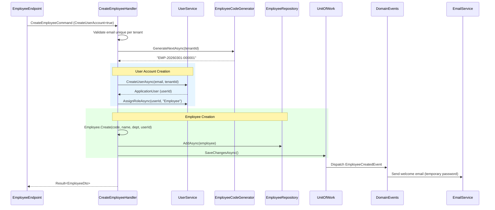
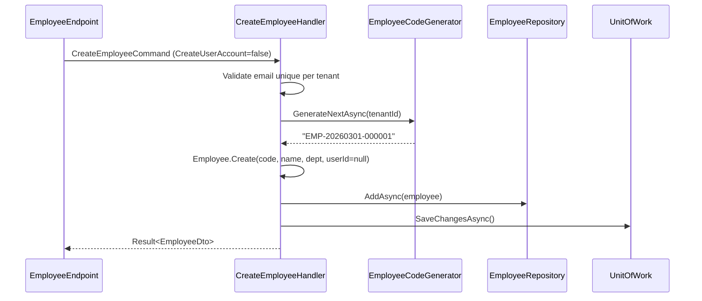

# Module: HR (Organizational Management)

> Priority: **Phase 1** (first ERP module). Complexity: Medium.
>
> Scope: Employee profiles, department hierarchy, dynamic tagging with categories. **No payroll, tax, insurance, attendance, or leave management.**

---

## Why First

HR defines **"who is in the organization and where they sit"**. Employee and Department are prerequisites for:
- **Project Management**: Task assignee = Employee
- **CRM**: Deal owner = Employee
- **Helpdesk**: Agent = Employee

Building HR first avoids migrating from raw `ApplicationUser` references later.

---

## Entities

```
Employee (TenantAggregateRoot<Guid>)
├── Id
├── EmployeeCode (auto: "EMP-YYYYMMDD-000001", atomic per tenant via SequenceCounter)
├── FirstName, LastName
├── Email (unique per tenant, validated format)
├── Phone (nullable)
├── Avatar (MediaFileId → MediaFile, nullable)
├── DepartmentId (FK → Department, required)
├── Position (string — job title, e.g. "Senior Developer")
├── ManagerId (FK → Employee, self-ref, nullable — null = top-level)
├── UserId (string? FK → ApplicationUser, nullable, unique per tenant)
├── JoinDate (DateTimeOffset, required)
├── EndDate (DateTimeOffset?, nullable — set on deactivation)
├── Status (EmployeeStatus enum)
├── EmploymentType (EmploymentType enum)
├── Notes (string?, free-text)
├── TenantId
├── TagAssignments[] (ICollection<EmployeeTagAssignment>)
├── DirectReports[] (ICollection<Employee> — inverse of ManagerId)
├── Department (navigation)
└── Manager (navigation, nullable)

Department (TenantAggregateRoot<Guid>)
├── Id
├── Name (unique per tenant per parent)
├── Code (string, short code e.g. "ENG", "MKT", unique per tenant)
├── Description (nullable)
├── ManagerId (FK → Employee, nullable)
├── ParentDepartmentId (FK → Department, self-ref, nullable — null = root)
├── SortOrder (int, default 0)
├── IsActive (bool, default true)
├── TenantId
├── Manager (navigation, nullable)
├── ParentDepartment (navigation, nullable)
├── SubDepartments[] (ICollection<Department>)
└── Employees[] (ICollection<Employee>)

EmployeeTag (TenantAggregateRoot<Guid>)
├── Id
├── Name (unique per tenant)
├── Category (EmployeeTagCategory enum — hardcoded)
├── Color (string, hex "#3B82F6")
├── Description (nullable)
├── EmployeeCount (int, denormalized — increment/decrement on assign/remove)
├── TenantId
└── Assignments[] (ICollection<EmployeeTagAssignment>)

EmployeeTagAssignment (TenantEntity<Guid> — junction table)
├── Id
├── EmployeeId (FK → Employee)
├── TagId (FK → EmployeeTag)
├── AssignedAt (DateTimeOffset)
└── TenantId
```

### Unique Constraints (CLAUDE.md Rule 18)

| Entity | Constraint | Index |
|--------|-----------|-------|
| Employee | `EmployeeCode + TenantId` | Unique |
| Employee | `Email + TenantId` | Unique |
| Employee | `UserId + TenantId` | Unique, filtered (`UserId IS NOT NULL`) |
| Department | `Code + TenantId` | Unique |
| Department | `Name + ParentDepartmentId + TenantId` | Unique (siblings only) |
| EmployeeTag | `Name + TenantId` | Unique |
| EmployeeTagAssignment | `EmployeeId + TagId + TenantId` | Unique (prevent duplicates) |

---

## Enums

```csharp
public enum EmployeeStatus
{
    Active,       // Currently employed
    Suspended,    // Temporarily suspended (disciplinary, investigation)
    Resigned,     // Voluntarily left
    Terminated    // Involuntarily terminated
}

public enum EmploymentType
{
    FullTime,
    PartTime,
    Contract,
    Intern
}

public enum EmployeeTagCategory
{
    Team,         // Cross-department teams: "Frontend Team", "Backend Team", "QA Team"
    Skill,        // Technical/professional: "React", "C#", "SQL", "Project Management"
    Project,      // Project assignments: "Project Alpha", "Project Beta"
    Location,     // Work arrangement: "Remote", "Office HCM", "Office HN", "Hybrid"
    Seniority,    // Level: "Junior", "Mid", "Senior", "Lead", "Principal"
    Employment,   // Phase: "Probation", "Training", "Notice Period"
    Custom        // Tenant-specific catch-all
}
```

**Why `EmployeeTagCategory` is a hardcoded enum (not DB table):**
- Other modules query tags by category: PM queries `Team` tags for team assignment, CRM queries `Skill` tags for matching
- Frontend groups tags by category in dropdowns and filters
- Consistent across tenants — same structure, tenant-specific tag values
- New categories require code change (intentional — keeps integration stable)

**Note:** `OnLeave` removed from `EmployeeStatus`. Leave management is out of scope. If long-term leave is needed (maternity, sabbatical), use tag `"On Leave"` in `Employment` category.

---

## Employee Code Generation

**Pattern:** Follow `OrderNumberGenerator.cs` using `SequenceCounter` table + SQL `MERGE WITH (HOLDLOCK)`.

**Format:** `EMP-YYYYMMDD-NNNNNN` (hardcoded prefix, date, 6-digit sequence)
- Example: `EMP-20260301-000001`, `EMP-20260301-000002`
- Sequence resets daily per tenant
- Atomic: no race conditions under concurrent requests

```csharp
// Application/Common/Interfaces/IEmployeeCodeGenerator.cs
public interface IEmployeeCodeGenerator
{
    Task<string> GenerateNextAsync(string? tenantId, CancellationToken ct = default);
}

// Infrastructure/Services/EmployeeCodeGenerator.cs
// Follows OrderNumberGenerator pattern exactly — SequenceCounter + MERGE WITH (HOLDLOCK)
// Prefix: $"EMP-{DateTime.UtcNow:yyyyMMdd}-", format: D6
```

---

## Manager Hierarchy Rules

### Depth Limit

**Hard cap: 20 levels.** Real-world organizations rarely exceed 10-12 levels (Fortune 500 = 6-8 levels CEO-to-IC). 20 gives headroom for complex conglomerates while preventing pathological data.

### Circular Reference Prevention

**Where:** Command handler (application layer) — not domain entity, not FluentValidation.

**Algorithm:** Single recursive CTE in one database query.

```
1. O(1) self-reference guard: ManagerId ≠ EmployeeId
2. Single recursive CTE: walk ancestors of proposed new manager
3. Depth check: ancestor chain length + 1 ≤ 20
4. Cycle check: employee being updated NOT in ancestor chain
5. If any check fails → Error.Validation() with clear message
```

```csharp
// Application/Common/Interfaces/IEmployeeHierarchyService.cs
public interface IEmployeeHierarchyService
{
    /// <summary>
    /// Returns ancestor chain of the given employee up to maxDepth.
    /// Used for circular reference and depth validation.
    /// </summary>
    Task<HierarchyChain> GetAncestorChainAsync(
        Guid employeeId, int maxDepth, string? tenantId, CancellationToken ct);
}

public record HierarchyChain(int Depth, HashSet<Guid> AncestorIds);

// Infrastructure implementation uses recursive CTE:
// WITH RECURSIVE chain AS (
//   SELECT Id, ManagerId, 1 AS Depth FROM Employees WHERE Id = @startId AND TenantId = @tenantId
//   UNION ALL
//   SELECT e.Id, e.ManagerId, c.Depth + 1 FROM Employees e JOIN chain c ON e.Id = c.ManagerId
//   WHERE c.Depth < @maxDepth AND e.TenantId = @tenantId
// )
// SELECT Id, Depth FROM chain;
//
// SQL Server: add OPTION (MAXRECURSION 20) as database-level backstop.
```

### Deactivation Side Effects

When an employee is deactivated (Resigned/Terminated):

| Relationship | Action | Rationale |
|---|---|---|
| Direct reports (`ManagerId → this`) | Set `ManagerId = null` | Reports become unassigned; admin reassigns manually |
| Department manager (`Department.ManagerId → this`) | Set `ManagerId = null` | Department becomes manager-less; admin reassigns |
| Tag assignments | Keep | Historical record; tags don't imply active status |
| User account (if linked) | Disable `ApplicationUser.IsActive = false` | Prevent portal login |

All side effects in a single transaction. Emit `EmployeeDeactivatedEvent` domain event for webhook/notification subscribers.

---

## Employee ↔ User Sync

### Creation Flow

When `CreateEmployeeCommand.CreateUserAccount = true`:



When `CreateUserAccount = false`:



Employee can be linked to User later via `LinkEmployeeToUserCommand`.

### Sync Rules

| Employee Change | User Effect |
|---|---|
| Email updated | Update `ApplicationUser.Email` (if linked) |
| Deactivated | `ApplicationUser.IsActive = false` (if linked) |
| Reactivated | `ApplicationUser.IsActive = true` (if linked) |
| User unlinked | No change to User — just clears `Employee.UserId` |

### Constraint

`Employee.UserId` is unique per tenant (filtered index where `UserId IS NOT NULL`). One User = one Employee per tenant.

---

## Features (Commands + Queries)

### Employee Management

| Command/Query | Audit | Description |
|---|---|---|
| `CreateEmployeeCommand` | `IAuditableCommand` | Create employee, auto-generate code, optionally create User account |
| `UpdateEmployeeCommand` | `IAuditableCommand` + before-state resolver | Update profile, position, department, manager (with hierarchy validation) |
| `DeactivateEmployeeCommand` | `IAuditableCommand` | Set status, EndDate, cascade side effects (see above) |
| `ReactivateEmployeeCommand` | `IAuditableCommand` | Set status back to Active, clear EndDate, re-enable User |
| `LinkEmployeeToUserCommand` | `IAuditableCommand` | Link existing Employee to existing User account |
| `GetEmployeesQuery` | — | Paginated list with Specification. Filters: department, status, type, tags, search text |
| `GetEmployeeByIdQuery` | — | Full detail with department, manager, tags, direct reports |
| `GetOrgChartQuery` | — | Department → Employee hierarchy tree (recursive CTE) |
| `SearchEmployeesQuery` | — | Quick search by name, email, employee code (lightweight, for autocomplete) |

### Department Management

| Command/Query | Audit | Description |
|---|---|---|
| `CreateDepartmentCommand` | `IAuditableCommand` | Create department, validate parent exists, code unique |
| `UpdateDepartmentCommand` | `IAuditableCommand` + before-state resolver | Update name, code, manager, parent. Validate no circular parent chain |
| `DeleteDepartmentCommand` | `IAuditableCommand` | Soft delete. **Fail** if has active employees or active sub-departments |
| `ReorderDepartmentsCommand` | `IAuditableCommand` | Batch update SortOrder for sibling departments |
| `GetDepartmentsQuery` | — | Tree structure with employee counts per department |
| `GetDepartmentByIdQuery` | — | Detail with employees list (paginated), sub-departments |

### Tag Management

| Command/Query | Audit | Description |
|---|---|---|
| `CreateTagCommand` | `IAuditableCommand` | Create tag with category, name (unique/tenant), color |
| `UpdateTagCommand` | `IAuditableCommand` + before-state resolver | Update name, color, description. Cannot change category |
| `DeleteTagCommand` | `IAuditableCommand` | Remove tag + all assignments. Decrement counts |
| `GetTagsQuery` | — | List all tags with employee counts. Filter by category |
| `AssignTagsCommand` | `IAuditableCommand` | Add tags to employee (bulk). Increment EmployeeCount |
| `RemoveTagsCommand` | `IAuditableCommand` | Remove tags from employee. Decrement EmployeeCount |
| `GetEmployeesByTagQuery` | — | Paginated employees with specific tag |

**All queries use Specifications with `.TagWith("MethodName")` (CLAUDE.md Rule 2).**
**All mutation Specifications use `.AsTracking()` (CLAUDE.md Rule 8).**

---

## Validation Rules

### Employee

| Field | Rule |
|-------|------|
| `FirstName` | Required, 1-100 chars |
| `LastName` | Required, 1-100 chars |
| `Email` | Required, valid email format, max 256, unique per tenant |
| `Phone` | Optional, max 20 chars |
| `DepartmentId` | Required, must exist and belong to tenant, department must be active |
| `Position` | Optional, max 100 chars |
| `ManagerId` | Optional. If set: must exist, must be active, no circular reference, depth <= 20 |
| `JoinDate` | Required |
| `EndDate` | Optional. Required when deactivating. Must be >= JoinDate |
| `Status` | Required, valid `EmployeeStatus` enum |
| `EmploymentType` | Required, valid `EmploymentType` enum |
| `Notes` | Optional, max 2000 chars |
| `CreateUserAccount` | If true: email must not already have a User account in tenant |

### Department

| Field | Rule |
|-------|------|
| `Name` | Required, 1-200 chars, unique per parent + tenant |
| `Code` | Required, 1-20 chars, unique per tenant, uppercase alphanumeric |
| `Description` | Optional, max 500 chars |
| `ManagerId` | Optional. If set: must be active Employee in tenant |
| `ParentDepartmentId` | Optional. If set: must exist, no circular reference, depth <= 20 |
| `SortOrder` | Required, >= 0 |

### Tag

| Field | Rule |
|-------|------|
| `Name` | Required, 1-100 chars, unique per tenant |
| `Category` | Required, valid `EmployeeTagCategory` enum. Cannot be changed after creation |
| `Color` | Required, valid hex format (e.g. "#3B82F6"), max 7 chars |
| `Description` | Optional, max 500 chars |

---

## DTOs (Response Shapes)

### EmployeeDto (detail view — `GetEmployeeByIdQuery`)

```csharp
public record EmployeeDto(
    Guid Id,
    string EmployeeCode,
    string FirstName,
    string LastName,
    string Email,
    string? Phone,
    string? AvatarUrl,                // Resolved from MediaFileId
    Guid DepartmentId,
    string DepartmentName,            // Flattened from Department.Name
    string? Position,
    Guid? ManagerId,
    string? ManagerName,              // Flattened: Manager.FirstName + " " + Manager.LastName
    string? UserId,
    bool HasUserAccount,              // UserId != null
    DateTimeOffset JoinDate,
    DateTimeOffset? EndDate,
    EmployeeStatus Status,
    EmploymentType EmploymentType,
    string? Notes,
    IReadOnlyList<TagBriefDto> Tags,
    IReadOnlyList<DirectReportDto> DirectReports,
    DateTimeOffset CreatedAt,
    DateTimeOffset LastModifiedAt
);
```

### EmployeeListDto (table row — `GetEmployeesQuery`)

```csharp
public record EmployeeListDto(
    Guid Id,
    string EmployeeCode,
    string FirstName,
    string LastName,
    string Email,
    string? AvatarUrl,
    string DepartmentName,
    string? Position,
    string? ManagerName,
    EmployeeStatus Status,
    EmploymentType EmploymentType,
    IReadOnlyList<TagBriefDto> Tags
);
```

### EmployeeSearchDto (autocomplete — `SearchEmployeesQuery`)

```csharp
public record EmployeeSearchDto(
    Guid Id,
    string EmployeeCode,
    string FullName,                  // FirstName + " " + LastName
    string? AvatarUrl,
    string? Position,
    string DepartmentName
);
```

### DirectReportDto (nested in EmployeeDto)

```csharp
public record DirectReportDto(
    Guid Id,
    string EmployeeCode,
    string FullName,
    string? AvatarUrl,
    string? Position,
    EmployeeStatus Status
);
```

### DepartmentDto (detail — `GetDepartmentByIdQuery`)

```csharp
public record DepartmentDto(
    Guid Id,
    string Name,
    string Code,
    string? Description,
    Guid? ManagerId,
    string? ManagerName,
    Guid? ParentDepartmentId,
    string? ParentDepartmentName,
    int SortOrder,
    bool IsActive,
    int EmployeeCount,
    IReadOnlyList<DepartmentTreeNodeDto> SubDepartments
);
```

### DepartmentTreeNodeDto (tree — `GetDepartmentsQuery`)

```csharp
public record DepartmentTreeNodeDto(
    Guid Id,
    string Name,
    string Code,
    string? ManagerName,
    int EmployeeCount,
    bool IsActive,
    IReadOnlyList<DepartmentTreeNodeDto> Children
);
```

### EmployeeTagDto (tag management — `GetTagsQuery`)

```csharp
public record EmployeeTagDto(
    Guid Id,
    string Name,
    EmployeeTagCategory Category,
    string Color,
    string? Description,
    int EmployeeCount
);
```

### TagBriefDto (embedded on employee rows)

```csharp
public record TagBriefDto(
    Guid Id,
    string Name,
    EmployeeTagCategory Category,
    string Color
);
```

### OrgChartNodeDto (org chart — `GetOrgChartQuery`)

```csharp
public record OrgChartNodeDto(
    Guid Id,
    OrgChartNodeType Type,            // Department or Employee
    string Name,                      // Department name or employee full name
    string? Subtitle,                 // Department code or employee position
    string? AvatarUrl,                // Employee avatar (null for departments)
    int? EmployeeCount,               // Only for departments
    EmployeeStatus? Status,           // Only for employees
    IReadOnlyList<OrgChartNodeDto> Children
);

public enum OrgChartNodeType
{
    Department,
    Employee
}
```

---

## Frontend Pages

| Route | Page | URL State | Features |
|---|---|---|---|
| `/portal/hr/employees` | Employee list | `useUrlDialog('create-employee')`, `useUrlEditDialog<Employee>`, URL filter params | DataTable, search, filter by department/status/tags, create/edit dialogs |
| `/portal/hr/employees/:id` | Employee detail | `useUrlTab({ defaultTab: 'overview' })` — tabs: overview, tags, activity | Profile card, department, manager, notes, direct reports list |
| `/portal/hr/departments` | Department list | `useUrlDialog('create-department')`, `useUrlEditDialog<Department>` | Tree view with collapse/expand, flat list toggle, employee count badges |
| `/portal/hr/tags` | Tag management | `useUrlDialog('create-tag')`, `useUrlEditDialog<EmployeeTag>` | Grouped by category, CRUD, color picker, usage count, click → filter employees |
| `/portal/hr/org-chart` | Org chart | — | Interactive tree visualization (see Org Chart Strategy below) |

### Key UI Components (UIKit Reuse)

| Component | UIKit Base | Notes |
|---|---|---|
| `EmployeeTable` | `DataTable` | Avatar via `FilePreviewTrigger`, status via `getStatusBadgeClasses`, tag chips |
| `EmployeeForm` | `Credenza` | Department dropdown, manager autocomplete (`SearchEmployeesQuery`), tag multi-select grouped by category |
| `DepartmentTree` | Custom (pure CSS) | Collapsible tree with `ChevronRight` rotate animation, employee count `Badge` |
| `OrgChart` | `d3-org-chart` wrapper | Custom React card nodes, zoom/pan, expand/collapse branches |
| `TagChips` | `Badge` with `variant="outline"` | Colored via tag.Color, `cursor-pointer`, click to filter |
| `TagManager` | `DataTable` grouped | Group by category, color picker, `EmptyState` for empty categories |

### Design Rules (per CLAUDE.md)

- All dialogs: `Credenza` (not `AlertDialog`)
- All destructive actions: confirmation dialog
- All interactive elements: `cursor-pointer`
- All icon-only buttons: `aria-label`
- All empty states: `<EmptyState icon={...} title={t('...')} description={t('...')} />`
- Form spacing: `space-y-4`
- Status badges: `variant="outline"` + `getStatusBadgeClasses()`

---

## Org Chart Strategy

### Research Summary

| Library | Bundle Size | Performance (1000+ nodes) | Customization | Verdict |
|---|---|---|---|---|
| `d3-org-chart` | ~140KB (with d3) | Good — Canvas + lazy expand | High — custom node HTML/React | **Recommended for Phase 3** |
| `react-organizational-chart` | ~5KB | Limited — DOM-based, no virtualization | Medium — accepts React children | Good for simple tree |
| ReactFlow/XyFlow | ~200KB | Excellent — virtualized canvas | Very high — custom nodes, edges | Overkill for org charts only |
| Pure CSS tree | 0KB | Good for <200 nodes | Low — manual collapse/expand | **Recommended for Phase 1** |

### Implementation Plan

**Phase 1 (MVP) — Department Tree:** Pure CSS/HTML collapsible tree.
- CSS `border-left` + `::before/::after` connectors
- `details/summary` or state-driven collapse/expand
- Sufficient for department hierarchy (typically <50 nodes)
- Zero dependencies

**Phase 3 — Full Org Chart:** `d3-org-chart` (140K+ monthly npm downloads).
- Zoom, pan, search, expand/collapse branches
- Lazy loading: fetch children on expand (for 500+ employees)
- Custom React card nodes rendered via `foreignObject`
- Export to PNG/PDF
- Responsive: horizontal layout on desktop, vertical on mobile

---

## Integration Points

| Module | Integration | Direction |
|---|---|---|
| **Users** | `Employee.UserId → ApplicationUser`. Auto-create User on employee creation. Sync email, active status | Bidirectional |
| **Project Management** | Task assignee = `Employee.Id`. PM queries employees by tag category `Team` | HR → PM |
| **CRM** | Deal/Lead owner = `Employee.Id`. CRM queries by `Skill` tags | HR → CRM |
| **Helpdesk** | Agent = `Employee.Id` | HR → Helpdesk |
| **Webhooks** | `employee.created`, `employee.updated`, `employee.deactivated`, `employee.department_changed`, `department.created`, `department.updated` | HR → Webhooks |
| **Activity Timeline** | All mutation commands implement `IAuditableCommand` | HR → Audit |
| **Notifications** | Employee status changes → notify relevant managers | HR → Notifications |

### Webhook Events (add to `WebhookEventTypeRegistry.cs`)

```csharp
{ typeof(EmployeeCreatedEvent), "employee.created" },
{ typeof(EmployeeUpdatedEvent), "employee.updated" },
{ typeof(EmployeeDeactivatedEvent), "employee.deactivated" },
{ typeof(EmployeeDepartmentChangedEvent), "employee.department_changed" },
{ typeof(DepartmentCreatedEvent), "department.created" },
{ typeof(DepartmentUpdatedEvent), "department.updated" },
```

---

## Module Definition

### ModuleNames (add to `ModuleNames.cs`)

```csharp
public static class Erp
{
    public const string Hr = "Erp.Hr";
}
```

### Module Definition

```csharp
// Application/Modules/Erp/HrModuleDefinition.cs
public sealed class HrModuleDefinition : IModuleDefinition, ISingletonService
{
    public string Name => ModuleNames.Erp.Hr;
    public string DisplayNameKey => "modules.erp.hr";
    public string DescriptionKey => "modules.erp.hr.description";
    public string Icon => "Users";
    public int SortOrder => 200;
    public bool IsCore => false;
    public bool DefaultEnabled => true;
    public IReadOnlyList<FeatureDefinition> Features =>
    [
        new(ModuleNames.Erp.Hr + ".Employees", "modules.erp.hr.employees", "modules.erp.hr.employees.description"),
        new(ModuleNames.Erp.Hr + ".Departments", "modules.erp.hr.departments", "modules.erp.hr.departments.description"),
        new(ModuleNames.Erp.Hr + ".Tags", "modules.erp.hr.tags", "modules.erp.hr.tags.description"),
    ];
}
```

### Permissions (add to `Permissions.cs`)

```csharp
// HR - Employees
public const string HrEmployeesRead = "hr:employees:read";
public const string HrEmployeesCreate = "hr:employees:create";
public const string HrEmployeesUpdate = "hr:employees:update";
public const string HrEmployeesDelete = "hr:employees:delete";

// HR - Departments
public const string HrDepartmentsRead = "hr:departments:read";
public const string HrDepartmentsCreate = "hr:departments:create";
public const string HrDepartmentsUpdate = "hr:departments:update";
public const string HrDepartmentsDelete = "hr:departments:delete";

// HR - Tags
public const string HrTagsRead = "hr:tags:read";
public const string HrTagsManage = "hr:tags:manage";
```

**Note:** Department permissions split to 4 (matching Employee pattern) for consistency. Previous design had single `hr:departments:manage` — now consistent across all HR entities.

### Endpoint Groups

```csharp
// Web/Endpoints/Hr/EmployeeEndpoints.cs
app.MapGroup("/api/hr/employees")
   .WithTags("HR - Employees")
   .RequireFeature(ModuleNames.Erp.Hr + ".Employees");

// Web/Endpoints/Hr/DepartmentEndpoints.cs
app.MapGroup("/api/hr/departments")
   .WithTags("HR - Departments")
   .RequireFeature(ModuleNames.Erp.Hr + ".Departments");

// Web/Endpoints/Hr/TagEndpoints.cs
app.MapGroup("/api/hr/tags")
   .WithTags("HR - Tags")
   .RequireFeature(ModuleNames.Erp.Hr + ".Tags");
```

---

## Localization Keys (EN + VI)

```
hr.employees                   / hr.nhanVien
hr.employees.create            / hr.nhanVien.tao
hr.employees.edit              / hr.nhanVien.sua
hr.employees.searchPlaceholder / hr.nhanVien.timKiem
hr.employees.noEmployeesFound  / hr.nhanVien.khongTimThay
hr.employees.deactivateConfirmation / hr.nhanVien.xacNhanNghiViec

hr.departments                 / hr.phongBan
hr.departments.create          / hr.phongBan.tao
hr.departments.deleteConfirmation / hr.phongBan.xacNhanXoa

hr.tags                        / hr.theTu
hr.tags.create                 / hr.theTu.tao
hr.tags.categories.team        / hr.theTu.danhMuc.nhom
hr.tags.categories.skill       / hr.theTu.danhMuc.kyNang
hr.tags.categories.project     / hr.theTu.danhMuc.duAn
hr.tags.categories.location    / hr.theTu.danhMuc.diaDiem
hr.tags.categories.seniority   / hr.theTu.danhMuc.capBac
hr.tags.categories.employment  / hr.theTu.danhMuc.tinhTrang
hr.tags.categories.custom      / hr.theTu.danhMuc.tuyChinh

hr.statuses.active             / hr.trangThai.dangLamViec
hr.statuses.suspended          / hr.trangThai.tamNgung
hr.statuses.resigned           / hr.trangThai.daNghiViec
hr.statuses.terminated         / hr.trangThai.daBiSaThải

hr.employmentTypes.fullTime    / hr.loaiHD.toanThoiGian
hr.employmentTypes.partTime    / hr.loaiHD.banThoiGian
hr.employmentTypes.contract    / hr.loaiHD.hopDong
hr.employmentTypes.intern      / hr.loaiHD.thucTap

hr.orgChart                    / hr.soDoToChuc
```

---

## Phased Implementation

### Phase 1 — Employee + Department (MVP)

```
Backend:
├── Domain: Employee, Department, EmployeeStatus, EmploymentType
│   ├── Domain events: EmployeeCreatedEvent, EmployeeUpdatedEvent, EmployeeDeactivatedEvent
│   │                  DepartmentCreatedEvent, DepartmentUpdatedEvent
│   └── Unique constraints per table above
├── Application:
│   ├── Features/Hr/Commands/CreateEmployee/ (Command + Handler + Validator) — IAuditableCommand
│   ├── Features/Hr/Commands/UpdateEmployee/ — IAuditableCommand + before-state resolver
│   ├── Features/Hr/Commands/DeactivateEmployee/ — IAuditableCommand + cascade side effects
│   ├── Features/Hr/Commands/ReactivateEmployee/ — IAuditableCommand
│   ├── Features/Hr/Commands/LinkEmployeeToUser/ — IAuditableCommand
│   ├── Features/Hr/Commands/CreateDepartment/ — IAuditableCommand
│   ├── Features/Hr/Commands/UpdateDepartment/ — IAuditableCommand + before-state resolver
│   ├── Features/Hr/Commands/DeleteDepartment/ — IAuditableCommand
│   ├── Features/Hr/Commands/ReorderDepartments/ — IAuditableCommand
│   ├── Features/Hr/Queries/GetEmployees/ — Specification + TagWith
│   ├── Features/Hr/Queries/GetEmployeeById/
│   ├── Features/Hr/Queries/SearchEmployees/
│   ├── Features/Hr/Queries/GetOrgChart/ — recursive CTE
│   ├── Features/Hr/Queries/GetDepartments/ — tree builder
│   ├── Features/Hr/Queries/GetDepartmentById/
│   ├── Common/Interfaces/IEmployeeCodeGenerator.cs
│   ├── Common/Interfaces/IEmployeeHierarchyService.cs
│   └── Modules/Erp/HrModuleDefinition.cs
├── Infrastructure:
│   ├── Persistence/Configurations/Hr/EmployeeConfiguration.cs
│   ├── Persistence/Configurations/Hr/DepartmentConfiguration.cs
│   ├── Persistence/Repositories/Hr/EmployeeRepository.cs
│   ├── Persistence/Repositories/Hr/DepartmentRepository.cs
│   ├── Services/EmployeeCodeGenerator.cs (SequenceCounter pattern)
│   ├── Services/EmployeeHierarchyService.cs (recursive CTE)
│   └── Migration: AddHrEmployeesAndDepartments
├── Endpoints: Hr/EmployeeEndpoints.cs, Hr/DepartmentEndpoints.cs
├── Permissions: 8 permissions (4 employee + 4 department)
├── Webhooks: Register 5 event types in WebhookEventTypeRegistry
└── Tests:
    ├── Domain: Employee.Create, Employee.Deactivate, Department.Create, hierarchy validation
    ├── Application: All command handlers, query handlers, validators
    ├── Integration: Repository DI, endpoint E2E, code generation concurrency
    └── Architecture: Verify new permissions count in All_ShouldContainAllPermissions

Frontend:
├── Pages: Employee list, Employee detail (:id with tabs), Department tree
├── Hooks: useEmployees, useDepartments, useOrgChart, useEmployeeSearch
├── Services: hr.ts (API calls)
├── Sidebar: HR section with nav items (gated by feature flag)
├── URL state: useUrlDialog, useUrlEditDialog, useUrlTab per page
├── i18n: EN + VI for all HR strings (see Localization Keys above)
└── Design: Follow all CLAUDE.md frontend rules (Credenza, EmptyState, cursor-pointer, etc.)
```

### Phase 2 — Tags + Tag Categories

```
Backend:
├── Domain: EmployeeTag, EmployeeTagAssignment, EmployeeTagCategory enum
├── Application:
│   ├── Features/Hr/Commands/CreateTag, UpdateTag, DeleteTag — IAuditableCommand
│   ├── Features/Hr/Commands/AssignTags, RemoveTags — IAuditableCommand
│   ├── Features/Hr/Queries/GetTags (filter by category), GetEmployeesByTag
│   └── Module: Add Hr.Tags sub-feature to HrModuleDefinition
├── Infrastructure:
│   ├── Configurations/Hr/EmployeeTagConfiguration.cs
│   ├── Configurations/Hr/EmployeeTagAssignmentConfiguration.cs
│   ├── Repositories/Hr/EmployeeTagRepository.cs
│   └── Migration: AddHrTags
├── Permissions: hr:tags:read, hr:tags:manage
└── Tests: Tag CRUD, assign/remove, unique constraint, employee count tracking

Frontend:
├── Pages: Tag management (grouped by category with color coding)
├── Components: TagChips, TagManager, tag filter on employee list + detail
├── Employee form: Add tag multi-select grouped by category
└── i18n: Tag category translations
```

### Phase 3 — Org Chart + Advanced

```
├── Org chart page: d3-org-chart integration with custom React card nodes
│   ├── Zoom/pan, expand/collapse branches, search
│   ├── Lazy loading: fetch children on expand
│   └── Export: PNG/PDF
├── Bulk operations: Bulk assign tags, bulk change department
├── Import: CSV import for bulk employee creation (critical for data migration)
├── Export: Employee list CSV/Excel
└── Reports: Headcount by department, tag distribution, employment type breakdown
```

---

## Architecture Reference

### File Structure

```
src/NOIR.Domain/
├── Entities/Hr/
│   ├── Employee.cs
│   ├── Department.cs
│   ├── EmployeeTag.cs
│   └── EmployeeTagAssignment.cs
├── Enums/
│   ├── EmployeeStatus.cs
│   ├── EmploymentType.cs
│   └── EmployeeTagCategory.cs
└── Events/Hr/
    ├── EmployeeCreatedEvent.cs
    ├── EmployeeUpdatedEvent.cs
    ├── EmployeeDeactivatedEvent.cs
    ├── EmployeeDepartmentChangedEvent.cs
    ├── DepartmentCreatedEvent.cs
    └── DepartmentUpdatedEvent.cs

src/NOIR.Application/
├── Features/Hr/
│   ├── Commands/{Action}/{Action}Command.cs + Handler + Validator
│   ├── Queries/{Action}/{Action}Query.cs + Handler
│   ├── DTOs/EmployeeDto.cs, DepartmentDto.cs, EmployeeTagDto.cs, OrgChartNodeDto.cs
│   └── Specifications/
│       ├── EmployeesByDepartmentSpec.cs
│       ├── EmployeesByStatusSpec.cs
│       ├── EmployeesByTagSpec.cs
│       ├── EmployeeSearchSpec.cs
│       ├── DepartmentsByParentSpec.cs
│       └── TagsByCategorySpec.cs
├── Common/Interfaces/
│   ├── IEmployeeCodeGenerator.cs
│   └── IEmployeeHierarchyService.cs
└── Modules/Erp/HrModuleDefinition.cs

src/NOIR.Infrastructure/
├── Persistence/Configurations/Hr/
│   ├── EmployeeConfiguration.cs
│   ├── DepartmentConfiguration.cs
│   ├── EmployeeTagConfiguration.cs
│   └── EmployeeTagAssignmentConfiguration.cs
├── Persistence/Repositories/Hr/
│   ├── EmployeeRepository.cs
│   └── DepartmentRepository.cs
└── Services/
    ├── EmployeeCodeGenerator.cs
    └── EmployeeHierarchyService.cs

src/NOIR.Web/
├── Endpoints/Hr/
│   ├── EmployeeEndpoints.cs
│   ├── DepartmentEndpoints.cs
│   └── TagEndpoints.cs
└── frontend/src/
    ├── portal-app/hr/
    │   ├── employees/
    │   │   ├── EmployeesPage.tsx
    │   │   ├── EmployeeDetailPage.tsx
    │   │   └── components/ (EmployeeTable, EmployeeForm, etc.)
    │   ├── departments/
    │   │   ├── DepartmentsPage.tsx
    │   │   └── components/ (DepartmentTree, DepartmentForm, etc.)
    │   ├── tags/
    │   │   ├── TagsPage.tsx
    │   │   └── components/ (TagManager, TagChips, etc.)
    │   └── org-chart/
    │       └── OrgChartPage.tsx
    ├── hooks/useEmployees.ts, useDepartments.ts, useTags.ts
    ├── services/hr.ts
    └── public/locales/{en,vi}/hr.json
```

---

## Migration Checklist

Before marking Phase 1 complete, verify:

- [ ] `dotnet build src/NOIR.sln` — 0 errors
- [ ] `dotnet test src/NOIR.sln` — ALL pass (including `All_ShouldContainAllPermissions` with updated count)
- [ ] `cd src/NOIR.Web/frontend && pnpm run build` — 0 errors
- [ ] New repositories have DI verification tests
- [ ] All new permissions registered in `Permissions.cs` and tested
- [ ] Webhook events registered in `WebhookEventTypeRegistry.cs`
- [ ] Before-state resolvers registered in `DependencyInjection.cs` for Update commands
- [ ] i18n keys in both `en/hr.json` and `vi/hr.json`
- [ ] All `cursor-pointer`, `aria-label`, `EmptyState` rules followed
