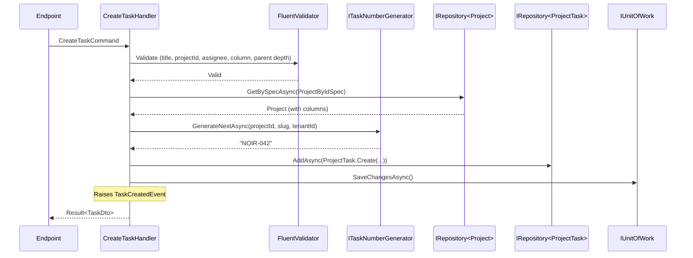
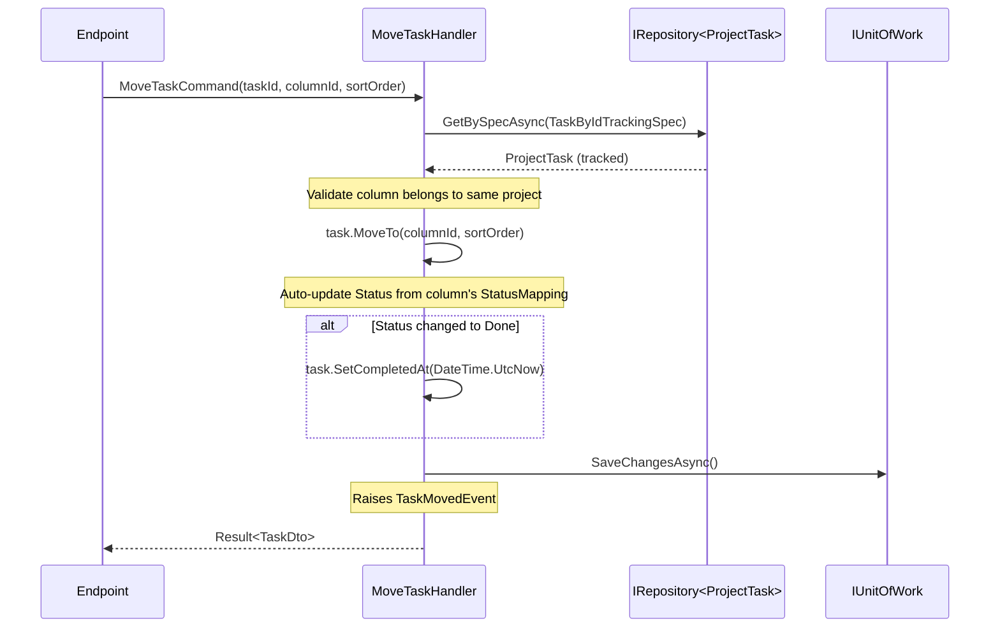

# Module: Project Management

> Priority: **Phase 3** (after CRM). Complexity: High. Depends on: HR (Employee as assignee/reporter/member).
>
> Scope: Projects, Kanban board, task management, comments, labels, time tracking, subtasks, bulk operations, import/export. **No Gantt chart editing, no resource leveling, no Agile-specific features (sprints, velocity, burndown), no external client portal.** Focus on simple, visual task management.

---

## Why This Module

Developers and SME teams are NOIR's primary users. A PM module is immediately useful and showcases ERP capabilities. Task assignment references Employee from HR module.

**Strategy**: `ProjectTask` entity name (not `Task`) to avoid collision with `System.Threading.Tasks.Task`. Project-scoped task numbering (`PROJ-001`) like JIRA for intuitive references.

---

## Entities

```
Project (TenantAggregateRoot<Guid>)
├── Id
├── ProjectCode (auto: "PRJ-YYYYMMDD-NNNNNN", atomic per tenant via SequenceCounter)
├── Name (string, required, max 200)
├── Slug (auto from Name, unique per tenant, max 100)
├── Description (string?, rich text, nullable)
├── Status (ProjectStatus enum)
├── StartDate (DateOnly?, nullable)
├── EndDate (DateOnly?, nullable)
├── DueDate (DateOnly?, nullable)
├── OwnerId (FK → Employee, required — project owner)
├── Budget (decimal?, nullable, precision 18,2)
├── Currency (string, max 3, default "VND")
├── Color (string?, hex, max 7, e.g. "#3B82F6")
├── Icon (string?, Lucide icon name, max 50, e.g. "folder-kanban")
├── Visibility (ProjectVisibility enum, default Internal)
├── TenantId
├── Members[] (ICollection<ProjectMember>)
├── Columns[] (ICollection<ProjectColumn>)
├── Tasks[] (ICollection<ProjectTask>)
├── Labels[] (ICollection<TaskLabel>)
├── Owner (navigation)
└── Metadata (string?, JSON custom fields, nullable)

ProjectMember (TenantEntity<Guid>)
├── Id
├── ProjectId (FK → Project, required)
├── EmployeeId (FK → Employee, required)
├── Role (ProjectMemberRole enum)
├── JoinedAt (DateTime, default UTC now)
├── TenantId
├── Project (navigation)
└── Employee (navigation)

ProjectColumn (TenantEntity<Guid>)
├── Id
├── ProjectId (FK → Project, required)
├── Name (string, required, max 100)
├── SortOrder (float — for insert-between: (prev + next) / 2)
├── Color (string?, hex, max 7)
├── StatusMapping (string — JSON array of TaskStatus values mapped to this column)
├── WipLimit (int?, nullable — null = unlimited)
├── TenantId
└── Project (navigation)

ProjectTask (TenantAggregateRoot<Guid>)
├── Id
├── ProjectId (FK → Project, required)
├── TaskNumber (auto: "{Slug}-{N}" e.g. "NOIR-001", sequential per project)
├── Title (string, required, max 500)
├── Description (string?, rich text via TinyMCE, nullable)
├── Status (TaskStatus enum)
├── Priority (TaskPriority enum, default Medium)
├── AssigneeId (FK → Employee, nullable — null = unassigned)
├── ReporterId (FK → Employee, required — who created)
├── DueDate (DateOnly?, nullable)
├── EstimatedHours (decimal?, nullable, precision 8,2)
├── ActualHours (decimal?, computed from TimeEntries, precision 8,2)
├── ParentTaskId (FK → ProjectTask, self-ref, nullable — null = top-level)
├── ColumnId (FK → ProjectColumn, required)
├── SortOrder (float — for Kanban drag-and-drop ordering within column)
├── CompletedAt (DateTime?, set when Status transitions to Done)
├── TenantId
├── Project (navigation)
├── Assignee (navigation, nullable)
├── Reporter (navigation)
├── ParentTask (navigation, nullable)
├── Column (navigation)
├── SubTasks[] (ICollection<ProjectTask> — inverse of ParentTaskId)
├── TaskLabels[] (ICollection<ProjectTaskLabel> — junction)
├── Comments[] (ICollection<TaskComment>)
└── TimeEntries[] (ICollection<TimeEntry>)

TaskLabel (TenantEntity<Guid>)
├── Id
├── ProjectId (FK → Project, required)
├── Name (string, required, max 50)
├── Color (string, hex, max 7, required)
├── TenantId
└── Project (navigation)

ProjectTaskLabel (TenantEntity<Guid>)
├── Id
├── TaskId (FK → ProjectTask, required)
├── LabelId (FK → TaskLabel, required)
├── TenantId
├── Task (navigation)
└── Label (navigation)

TaskComment (TenantEntity<Guid>)
├── Id
├── TaskId (FK → ProjectTask, required)
├── AuthorId (FK → Employee, required)
├── Content (string, rich text, required, max 5000)
├── IsEdited (bool, default false)
├── CreatedAt (DateTime)
├── UpdatedAt (DateTime?)
├── TenantId
├── Task (navigation)
└── Author (navigation)

TimeEntry (TenantEntity<Guid>)
├── Id
├── TaskId (FK → ProjectTask, required)
├── EmployeeId (FK → Employee, required)
├── StartTime (DateTime, required)
├── EndTime (DateTime?, nullable — null = timer running)
├── Duration (TimeSpan, computed: EndTime - StartTime)
├── Description (string?, max 500, nullable)
├── Billable (bool, default false)
├── BillableRate (decimal?, nullable, precision 18,2)
├── TenantId
├── Task (navigation)
└── Employee (navigation)
```

**Naming note**: Entity is `ProjectTask` (not `Task`) to avoid collision with `System.Threading.Tasks.Task`.

---

### Unique Constraints (CLAUDE.md Rule 18)

| Entity | Columns | Type | Notes |
|--------|---------|------|-------|
| Project | TenantId + ProjectCode | Unique index | Auto-generated, always unique |
| Project | TenantId + Slug | Unique index | Auto-slugified from Name |
| ProjectMember | TenantId + ProjectId + EmployeeId | Unique index | One membership per employee per project |
| ProjectColumn | TenantId + ProjectId + Name | Unique index | No duplicate column names in same project |
| TaskLabel | TenantId + ProjectId + Name | Unique index | No duplicate label names in same project |
| ProjectTaskLabel | TenantId + TaskId + LabelId | Unique index | Prevent duplicate label assignment |
| ProjectTask | TenantId + ProjectId + TaskNumber | Unique index | Sequential per project |

---

## Enums

```csharp
public enum ProjectStatus
{
    Active,       // Actively worked on (default for new projects)
    OnHold,       // Temporarily paused
    Completed,    // All work finished
    Archived      // Historical, hidden from default views
}
// Rationale: 4 states. Active = working, OnHold = paused but not done, Completed = success, Archived = cold storage.

public enum ProjectVisibility
{
    Private,      // Only project members can see
    Internal,     // All tenant employees can see (default)
    Public        // All tenant users including non-employee accounts
}
// Rationale: Controls who can view project. Internal is safe default.

public enum ProjectMemberRole
{
    Owner,        // Full control, can delete project (one per project)
    Manager,      // Can manage members, columns, labels
    Member,       // Can create/edit tasks, log time
    Viewer        // Read-only access
}
// Rationale: 4 roles matching common PM patterns. Owner enforced unique per project.

public enum TaskStatus
{
    Todo,         // Not started
    InProgress,   // Being worked on
    InReview,     // Awaiting review
    Done,         // Completed
    Cancelled     // Will not be done
}
// Rationale: 5 states. Maps to default 4 columns (Done + Cancelled both in "Done" column).

public enum TaskPriority
{
    Low,          // Nice to have
    Medium,       // Normal priority (default)
    High,         // Should be done soon
    Urgent        // Must be done immediately
}
// Rationale: 4 levels matching industry standard. Medium = default.
```

---

## Task Number Generation

**Format**: `{ProjectSlug}-{N}` where N is sequential per project (e.g., `NOIR-001`, `NOIR-002`).

**Interface**: `ITaskNumberGenerator`

```csharp
public interface ITaskNumberGenerator
{
    Task<string> GenerateNextAsync(Guid projectId, string projectSlug, string? tenantId, CancellationToken ct = default);
}
```

**Implementation**: Uses `SequenceCounter` with prefix = `TSK-{ProjectId}`. Output: `{Slug}-{N:D3}`. If project has 999+ tasks, auto-extends to 4 digits.

**Thread safety**: Same MERGE WITH (HOLDLOCK) pattern as `EmployeeCodeGenerator`.

---

## Kanban SortOrder Strategy

**Float-based ordering** for insert-between without reindexing:

| Action | Algorithm |
|--------|-----------|
| Insert at beginning | `SortOrder = firstItem.SortOrder - 1.0` |
| Insert at end | `SortOrder = lastItem.SortOrder + 1.0` |
| Insert between A and B | `SortOrder = (A.SortOrder + B.SortOrder) / 2.0` |
| Precision exhaustion | If `|A - B| < 0.001`, reindex all items in column (1.0, 2.0, 3.0, ...) |

Same strategy for `ProjectColumn.SortOrder`.

---

## Subtask Hierarchy Rules

| Rule | Details |
|------|---------|
| Max depth | 3 levels (task → subtask → sub-subtask). Validated via CTE. |
| Circular reference | Check ancestor chain. Error: `"Cannot set parent: would create circular reference."` |
| Parent must be same project | `ParentTask.ProjectId == Task.ProjectId`. Error: `"Parent task must be in the same project."` |
| Status cascade | Completing parent does NOT auto-complete subtasks. Warning shown in UI. |
| Delete cascade | Deleting parent soft-deletes all subtasks recursively. |
| Progress roll-up | `SubTaskProgress` = `{completed}/{total}` computed at query time, not stored. |

**Hierarchy validation**: Same CTE pattern as HR's `IEmployeeHierarchyService`:
```sql
WITH AncestorChain AS (
    SELECT Id, ParentTaskId, 1 AS Depth FROM ProjectTasks WHERE Id = @parentTaskId
    UNION ALL
    SELECT pt.Id, pt.ParentTaskId, ac.Depth + 1
    FROM ProjectTasks pt JOIN AncestorChain ac ON pt.Id = ac.ParentTaskId
    WHERE ac.Depth < 5  -- safety
)
SELECT COUNT(*) FROM AncestorChain
```

---

## Features (Commands + Queries)

### Project Management

| Command/Query | Audit | Description |
|---------------|-------|-------------|
| `CreateProjectCommand` | Yes | Create project, add creator as Owner member, seed 4 default columns |
| `UpdateProjectCommand` | Yes | Update name, description, dates, budget, color, icon, visibility |
| `ChangeProjectStatusCommand` | Yes | Active ↔ OnHold ↔ Completed ↔ Archived (state machine) |
| `DeleteProjectCommand` | Yes | Soft delete project + all tasks/columns/labels/comments/time entries |
| `GetProjectsQuery` | No | Paginated list, filter by status/owner/visibility/member |
| `GetProjectByIdQuery` | No | Full detail with members, column config, task counts |
| `SearchProjectsQuery` | No | Lightweight search for autocomplete (id, name, code, slug) |

### Project Members

| Command/Query | Audit | Description |
|---------------|-------|-------------|
| `AddProjectMemberCommand` | Yes | Add employee to project with role. Fail if already member. |
| `RemoveProjectMemberCommand` | Yes | Remove member. Fail if Owner (transfer ownership first). |
| `ChangeProjectMemberRoleCommand` | Yes | Change member role. Only one Owner allowed. |
| `GetProjectMembersQuery` | No | List members with roles and employee info |

### Task CRUD

| Command/Query | Audit | Description |
|---------------|-------|-------------|
| `CreateTaskCommand` | Yes | Create task in project, auto-assign TaskNumber, place in column |
| `UpdateTaskCommand` | Yes | Update title, description, priority, assignee, dates, estimated hours |
| `MoveTaskCommand` | Yes | Change column + SortOrder (Kanban drag). Auto-updates Status from column mapping. |
| `ReorderTaskCommand` | Yes | Change SortOrder within same column (Kanban reorder) |
| `ChangeTaskStatusCommand` | Yes | Direct status change (sets CompletedAt when Done) |
| `DeleteTaskCommand` | Yes | Soft delete task + subtasks recursively |
| `GetTasksQuery` | No | Paginated, filter by status/assignee/priority/label/column |
| `GetTaskByIdQuery` | No | Full detail with comments, subtasks, time entries, labels |
| `GetKanbanBoardQuery` | No | Columns with tasks, optimized for board view |
| `SearchTasksQuery` | No | Search by task number or title for autocomplete |

### Subtasks

| Command/Query | Audit | Description |
|---------------|-------|-------------|
| `AddSubtaskCommand` | Yes | Create task with ParentTaskId. Validates depth ≤ 3 and same project. |

### Task Labels

| Command/Query | Audit | Description |
|---------------|-------|-------------|
| `CreateLabelCommand` | Yes | Create label for project |
| `UpdateLabelCommand` | Yes | Rename or recolor label |
| `DeleteLabelCommand` | Yes | Delete label, remove all task associations |
| `AttachLabelCommand` | Yes | Attach label to task |
| `DetachLabelCommand` | Yes | Detach label from task |

### Task Comments

| Command/Query | Audit | Description |
|---------------|-------|-------------|
| `AddTaskCommentCommand` | Yes | Add comment to task. Author = current employee. |
| `UpdateTaskCommentCommand` | Yes | Edit comment. Sets IsEdited = true. Only author can edit. |
| `DeleteTaskCommentCommand` | Yes | Soft delete comment. Author or project Manager/Owner can delete. |

### Time Tracking

| Command/Query | Audit | Description |
|---------------|-------|-------------|
| `StartTimerCommand` | Yes | Start timer for task. Stops any existing running timer first. |
| `StopTimerCommand` | Yes | Stop running timer, calculate duration. |
| `AddManualTimeEntryCommand` | Yes | Log time manually with start/end. |
| `UpdateTimeEntryCommand` | Yes | Edit time entry description, billable flag, rate. |
| `DeleteTimeEntryCommand` | Yes | Remove time entry. |
| `GetTimeEntriesQuery` | No | Filter by task/employee/date range. |
| `GetProjectTimeReportQuery` | No | Aggregated time report grouped by member and task. |

### Column Management

| Command/Query | Audit | Description |
|---------------|-------|-------------|
| `CreateColumnCommand` | Yes | Add column to project board |
| `UpdateColumnCommand` | Yes | Rename, recolor, change status mapping, set WIP limit |
| `ReorderColumnsCommand` | Yes | Change column sort order |
| `DeleteColumnCommand` | Yes | Remove column. Must specify target column for task migration. |

### Bulk Operations

| Command/Query | Audit | Description |
|---------------|-------|-------------|
| `BulkUpdateTasksCommand` | Yes | Update status/assignee/priority for multiple tasks |
| `BulkMoveTasksCommand` | Yes | Move multiple tasks to a column |
| `BulkDeleteTasksCommand` | Yes | Soft delete multiple tasks |

### Import/Export

| Command/Query | Audit | Description |
|---------------|-------|-------------|
| `ExportTasksQuery` | No | Export project tasks to CSV/Excel with filters |
| `ImportTasksCommand` | Yes | Import tasks from CSV. Creates in specified column. |

---

## DTOs (Response Shapes)

```csharp
// === Project DTOs ===

public sealed record ProjectDto(
    Guid Id,
    string ProjectCode,
    string Name,
    string Slug,
    string? Description,
    ProjectStatus Status,
    DateOnly? StartDate,
    DateOnly? EndDate,
    DateOnly? DueDate,
    Guid OwnerId,
    string OwnerName,         // Flattened from Employee
    string? OwnerAvatarUrl,
    decimal? Budget,
    string Currency,
    string? Color,
    string? Icon,
    ProjectVisibility Visibility,
    int MemberCount,          // Computed
    int TaskCount,            // Computed: all non-deleted tasks
    int CompletedTaskCount,   // Computed: tasks where Status == Done
    decimal ProgressPercent,  // Computed: CompletedTaskCount / TaskCount * 100
    List<ProjectMemberDto> Members,
    List<ProjectColumnDto> Columns,
    List<TaskLabelDto> Labels,
    DateTime CreatedAt,
    DateTime? ModifiedAt);

public sealed record ProjectListDto(
    Guid Id,
    string ProjectCode,
    string Name,
    string Slug,
    ProjectStatus Status,
    Guid OwnerId,
    string OwnerName,
    string? OwnerAvatarUrl,
    DateOnly? StartDate,
    DateOnly? DueDate,
    string? Color,
    string? Icon,
    ProjectVisibility Visibility,
    int MemberCount,
    int TaskCount,
    int CompletedTaskCount,
    decimal ProgressPercent,
    DateTime CreatedAt);

public sealed record ProjectSearchDto(
    Guid Id,
    string ProjectCode,
    string Name,
    string Slug);

// === Project Member DTOs ===

public sealed record ProjectMemberDto(
    Guid Id,
    Guid EmployeeId,
    string EmployeeName,      // Flattened: FirstName + " " + LastName
    string EmployeeCode,
    string? Position,
    string? AvatarUrl,
    ProjectMemberRole Role,
    DateTime JoinedAt);

// === Project Column DTOs ===

public sealed record ProjectColumnDto(
    Guid Id,
    string Name,
    float SortOrder,
    string? Color,
    List<TaskStatus> StatusMapping,
    int? WipLimit,
    int TaskCount);           // Computed: tasks in this column

// === Task DTOs ===

public sealed record TaskDto(
    Guid Id,
    Guid ProjectId,
    string ProjectName,
    string TaskNumber,
    string Title,
    string? Description,
    TaskStatus Status,
    TaskPriority Priority,
    Guid? AssigneeId,
    string? AssigneeName,
    string? AssigneeAvatarUrl,
    Guid ReporterId,
    string ReporterName,
    DateOnly? DueDate,
    decimal? EstimatedHours,
    decimal? ActualHours,      // Computed from TimeEntries
    Guid? ParentTaskId,
    string? ParentTaskNumber,
    Guid ColumnId,
    string ColumnName,
    DateTime? CompletedAt,
    List<TaskLabelDto> Labels,
    List<TaskCommentDto> Comments,
    List<SubTaskDto> SubTasks,
    List<TimeEntryDto> TimeEntries,
    SubTaskProgressDto SubTaskProgress,  // { completed, total }
    DateTime CreatedAt,
    DateTime? ModifiedAt);

public sealed record TaskListDto(
    Guid Id,
    string TaskNumber,
    string Title,
    TaskStatus Status,
    TaskPriority Priority,
    Guid? AssigneeId,
    string? AssigneeName,
    string? AssigneeAvatarUrl,
    Guid ReporterId,
    string ReporterName,
    DateOnly? DueDate,
    Guid ColumnId,
    string ColumnName,
    int LabelCount,
    int CommentCount,
    SubTaskProgressDto SubTaskProgress,
    DateTime CreatedAt);

public sealed record TaskCardDto(
    Guid Id,
    string TaskNumber,
    string Title,
    TaskPriority Priority,
    Guid? AssigneeId,
    string? AssigneeName,
    string? AssigneeAvatarUrl,
    DateOnly? DueDate,
    List<TaskLabelDto> Labels,
    SubTaskProgressDto SubTaskProgress,
    int CommentCount,
    float SortOrder);

public sealed record SubTaskDto(
    Guid Id,
    string TaskNumber,
    string Title,
    TaskStatus Status,
    TaskPriority Priority,
    Guid? AssigneeId,
    string? AssigneeName,
    DateOnly? DueDate);

public sealed record SubTaskProgressDto(
    int Completed,
    int Total);

// === Task Label ===

public sealed record TaskLabelDto(
    Guid Id,
    string Name,
    string Color);

// === Task Comment ===

public sealed record TaskCommentDto(
    Guid Id,
    Guid AuthorId,
    string AuthorName,
    string? AuthorAvatarUrl,
    string Content,
    bool IsEdited,
    DateTime CreatedAt,
    DateTime? UpdatedAt);

// === Time Entry ===

public sealed record TimeEntryDto(
    Guid Id,
    Guid TaskId,
    string TaskNumber,
    Guid EmployeeId,
    string EmployeeName,
    DateTime StartTime,
    DateTime? EndTime,
    TimeSpan Duration,
    string? Description,
    bool Billable,
    decimal? BillableRate);

public sealed record TimeReportDto(
    Guid EmployeeId,
    string EmployeeName,
    TimeSpan TotalTime,
    TimeSpan BillableTime,
    decimal BillableAmount,
    List<TimeReportTaskDto> Tasks);

public sealed record TimeReportTaskDto(
    Guid TaskId,
    string TaskNumber,
    string TaskTitle,
    TimeSpan TotalTime,
    int EntryCount);

// === Kanban Board ===

public sealed record KanbanBoardDto(
    Guid ProjectId,
    string ProjectName,
    List<KanbanColumnDto> Columns);

public sealed record KanbanColumnDto(
    Guid Id,
    string Name,
    string? Color,
    float SortOrder,
    int? WipLimit,
    bool IsOverWipLimit,      // Computed: TaskCount > WipLimit
    List<TaskCardDto> Tasks);

// === Request DTOs ===

public sealed record CreateProjectRequest(
    string Name,
    string? Description,
    DateOnly? StartDate,
    DateOnly? EndDate,
    DateOnly? DueDate,
    Guid OwnerId,
    decimal? Budget,
    string? Currency,
    string? Color,
    string? Icon,
    ProjectVisibility? Visibility);

public sealed record UpdateProjectRequest(
    string Name,
    string? Description,
    DateOnly? StartDate,
    DateOnly? EndDate,
    DateOnly? DueDate,
    decimal? Budget,
    string? Currency,
    string? Color,
    string? Icon,
    ProjectVisibility? Visibility);

public sealed record CreateTaskRequest(
    string Title,
    string? Description,
    TaskPriority? Priority,
    Guid? AssigneeId,
    DateOnly? DueDate,
    decimal? EstimatedHours,
    Guid? ParentTaskId,
    Guid? ColumnId,
    List<Guid>? LabelIds);

public sealed record UpdateTaskRequest(
    string Title,
    string? Description,
    TaskPriority? Priority,
    Guid? AssigneeId,
    DateOnly? DueDate,
    decimal? EstimatedHours);

public sealed record MoveTaskRequest(
    Guid ColumnId,
    float SortOrder);

public sealed record AddProjectMemberRequest(
    Guid EmployeeId,
    ProjectMemberRole Role);

public sealed record CreateColumnRequest(
    string Name,
    string? Color,
    List<TaskStatus>? StatusMapping,
    int? WipLimit);

public sealed record BulkUpdateTasksRequest(
    List<Guid> TaskIds,
    TaskStatus? Status,
    Guid? AssigneeId,
    TaskPriority? Priority);

public sealed record AddManualTimeEntryRequest(
    DateTime StartTime,
    DateTime EndTime,
    string? Description,
    bool Billable,
    decimal? BillableRate);
```

---

## Validation Rules

### Project Validation

| Field | Rule |
|-------|------|
| Name | Required, 1-200 chars |
| Description | Max 10,000 chars (rich text) |
| Slug | Auto-generated, unique per tenant, max 100 chars |
| OwnerId | Required, must be active Employee in same tenant |
| StartDate | Optional. If EndDate set, StartDate ≤ EndDate |
| EndDate | Optional. If StartDate set, EndDate ≥ StartDate |
| DueDate | Optional |
| Budget | If provided, must be ≥ 0 |
| Currency | 3-letter ISO code, default "VND" |
| Color | If provided, valid hex format (#RRGGBB) |
| Icon | If provided, max 50 chars |
| Visibility | Valid enum value, default Internal |
| Status transition | Active ↔ OnHold (bidirectional), Active/OnHold → Completed, Any → Archived. Cannot un-archive. |

### Task Validation

| Field | Rule |
|-------|------|
| Title | Required, 1-500 chars |
| Description | Max 50,000 chars (rich text) |
| ProjectId | Required, must exist and not be Archived |
| Priority | Valid enum value, default Medium |
| AssigneeId | If provided, must be active Employee AND project member |
| ReporterId | Required, must be active Employee AND project member |
| DueDate | Optional |
| EstimatedHours | If provided, must be > 0 and ≤ 9999.99 |
| ParentTaskId | If provided, must be in same project, depth ≤ 3, no circular ref |
| ColumnId | Required, must belong to same project |
| LabelIds | If provided, all labels must belong to same project |

### Column Validation

| Field | Rule |
|-------|------|
| Name | Required, 1-100 chars, unique per project |
| Color | If provided, valid hex format |
| StatusMapping | Valid TaskStatus values (JSON array) |
| WipLimit | If provided, must be ≥ 1 |
| Delete | Must specify MoveTasksToColumnId. Cannot delete last column. |

### Time Entry Validation

| Field | Rule |
|-------|------|
| TaskId | Required, must exist |
| StartTime | Required, cannot be in the future |
| EndTime | If provided, must be > StartTime. Max duration: 24 hours. |
| Description | Max 500 chars |
| BillableRate | If Billable = true, rate ≥ 0 |
| Running timer | Only one running timer per employee (across all projects) |

### Comment Validation

| Field | Rule |
|-------|------|
| Content | Required, 1-5,000 chars |
| Edit | Only author can edit their comment |
| Delete | Author, or project Manager/Owner can delete |

---

## Edge Cases

### 1. Project Deletion Protection

Projects with active tasks (Status ≠ Done/Cancelled) show warning:
```
"This project has {N} active tasks. Deleting will archive all tasks. Continue?"
```
Backend: Soft-delete cascades to all tasks, columns, labels, comments, time entries.

### 2. Owner Transfer

Cannot remove Owner without transferring ownership first:
```
Error: "Cannot remove project owner. Transfer ownership to another member first."
```
`ChangeProjectMemberRoleCommand` handles: if new role = Owner, demote existing Owner to Manager.

### 3. Column Deletion with Tasks

Must specify target column for task migration:
```
Error: "Cannot delete column with tasks. Specify a target column to move tasks to."
```
`DeleteColumnCommand(Id, MoveTasksToColumnId)` — moves all tasks, updates SortOrder sequentially.

Cannot delete last column:
```
Error: "Cannot delete the only column. Projects must have at least one column."
```

### 4. WIP Limit Enforcement

WIP limit is **advisory, not blocking**. UI shows column header in red/warning when over limit. Backend allows moving tasks beyond WIP limit but returns `IsOverWipLimit = true` in `KanbanColumnDto`.

### 5. Task Status ↔ Column Sync

When task moves to a column, status auto-updates to the column's first StatusMapping value:
- Move to "In Progress" column (StatusMapping: [InProgress]) → Status = InProgress
- Move to "Done" column (StatusMapping: [Done, Cancelled]) → Status = Done

When status is changed directly (not via drag), task stays in current column (no auto-move).

### 6. Running Timer Conflict

Only one timer can run per employee across all projects:
```
"You have a running timer on task {TaskNumber}. It will be stopped automatically."
```
`StartTimerCommand`: stops existing running timer (sets EndTime = now), then starts new timer.

### 7. Assignee Deactivation (HR Integration)

If an assigned employee is deactivated in HR:
- Tasks remain assigned (no auto-unassign)
- UI shows "(Inactive)" badge next to assignee name
- Admin can bulk-reassign via `BulkUpdateTasksCommand`

### 8. Archived Project Access

Archived projects are read-only:
```
Error: "Cannot modify archived project. Change status to Active first."
```
All mutation commands check `project.Status != Archived`.

---

## Sequence Diagrams

### Create Task with Auto-Numbering



### Move Task (Kanban Drag)



---

## Specifications

```csharp
// Project specs
ProjectByIdSpec                  // TagWith("ProjectById") — detail with members, columns, labels
ProjectByIdTrackingSpec          // TagWith("ProjectByIdTracking") — for mutations
ProjectBySlugSpec                // TagWith("ProjectBySlug") — for slug lookup
ProjectsFilterSpec               // TagWith("GetProjects") — paginated, filter by status/owner/visibility/member
ProjectsCountSpec                // TagWith("CountProjects") — count only
ProjectSearchSpec                // TagWith("SearchProjects") — lightweight name/code search
ProjectsByOwnerSpec              // TagWith("ProjectsByOwner") — filter by owner employee

// Task specs
TaskByIdSpec                     // TagWith("TaskById") — detail with comments, labels, subtasks, time entries
TaskByIdTrackingSpec             // TagWith("TaskByIdTracking") — for mutations
TasksByProjectFilterSpec         // TagWith("GetTasks") — paginated, filter by status/assignee/priority/label
TasksCountSpec                   // TagWith("CountTasks") — count only
KanbanBoardSpec                  // TagWith("GetKanbanBoard") — columns with tasks, AsSplitQuery
TaskSearchSpec                   // TagWith("SearchTasks") — by task number or title
TasksByAssigneeSpec              // TagWith("TasksByAssignee") — for employee's task list
SubTasksSpec                     // TagWith("SubTasks") — children of a parent task
RunningTimerSpec                 // TagWith("RunningTimer") — find running timer for employee

// Time entry specs
TimeEntriesByTaskSpec            // TagWith("TimeEntriesByTask") — for task detail
TimeEntriesByEmployeeSpec        // TagWith("TimeEntriesByEmployee") — for time report
TimeEntriesFilterSpec            // TagWith("GetTimeEntries") — filter by task/employee/date range
```

---

## Frontend Pages

| Route | Page | URL State |
|-------|------|-----------|
| `/portal/projects` | Project list | `?status=Active&owner=guid` filter params |
| `/portal/projects/:id` | Project detail (tabs) | `useUrlTab({ defaultTab: 'board' })` |
| `/portal/projects/:id?tab=board` | Kanban board | Default tab |
| `/portal/projects/:id?tab=list` | List view (table) | |
| `/portal/projects/:id?tab=settings` | Project settings | Members, labels, columns config |
| `/portal/tasks/:taskNumber` | Task detail | Full task view via task number (e.g., `/portal/tasks/NOIR-042`) |

### Key UI Components

| Component | Library | Description |
|-----------|---------|-------------|
| **KanbanBoard** | `@dnd-kit/core` + `@dnd-kit/sortable` | Drag-and-drop columns with task cards |
| **TaskCard** | Custom | Compact card: title, assignee avatar, priority badge, label chips, due date, subtask progress |
| **TaskDetailPanel** | Credenza (slide-over) | Full task info: description, comments, subtasks, time log, labels |
| **TimeTracker** | Custom | Start/stop button with running timer display |
| **ProjectMemberAvatars** | Custom | Stacked avatars showing project members |
| **ColumnSettingsDialog** | Credenza | Edit column name, color, WIP limit, status mapping |
| **LabelManager** | Custom | CRUD for project labels (name + color picker) |

### Design Rules (from CLAUDE.md)

- All interactive elements: `cursor-pointer`
- All icon-only buttons: `aria-label={contextual description}`
- Empty states: `<EmptyState icon={X} title={t('...')} description={t('...')} />`
- Dialogs: `Credenza` (not AlertDialog)
- Status badges: `variant="outline"` + `getStatusBadgeClasses()`
- Destructive actions: confirmation dialog required
- Card shadows: `shadow-sm hover:shadow-lg transition-all duration-300`
- Create dialogs: `useUrlDialog({ paramValue: 'create-project' })`
- Edit dialogs: `useUrlEditDialog<Project>(projects)`

---

## Integration Points

| Module | Integration | Direction |
|--------|-------------|-----------|
| **HR** | Employee as assignee/reporter/member. Department for project scoping. | HR → PM (read) |
| **Users** | Fallback: if HR not enabled, use UserId directly as assignee. | Users → PM (read) |
| **CRM** | Link deal activities to project tasks (future). | CRM → PM (future) |
| **Calendar** | Task due dates shown on calendar as read-only overlay. | PM → Calendar (push event) |
| **Notifications** | Task assigned, due date reminder (1 day before), comment @mention. | PM → Notifications (trigger) |
| **Webhooks** | `task.created`, `task.completed`, `project.created`, `project.archived` | PM → Webhooks (registry) |
| **Activity Timeline** | Task status changes, member added/removed. | PM → Audit (IAuditableCommand) |
| **Dashboard** | Project progress widget, overdue tasks count. | PM → Dashboard (query) |

---

## Module Definition

```csharp
// Application/Modules/ModuleNames.cs (already exists)
public static class Erp
{
    public const string Pm = "Erp.Pm";
}

// Application/Modules/Erp/PmModuleDefinition.cs (already exists)
public sealed class PmModuleDefinition : IModuleDefinition, ISingletonService
{
    public string Name => ModuleNames.Erp.Pm;
    public string DisplayNameKey => "modules.erp.pm";
    public string DescriptionKey => "modules.erp.pm.description";
    public string Icon => "FolderKanban";
    public int SortOrder => 310;
    public bool IsCore => false;
    public bool DefaultEnabled => true;

    public IReadOnlyList<FeatureDefinition> Features =>
    [
        new(ModuleNames.Erp.Pm + ".Projects", "modules.erp.pm.projects", "modules.erp.pm.projects.description"),
        new(ModuleNames.Erp.Pm + ".Tasks", "modules.erp.pm.tasks", "modules.erp.pm.tasks.description"),
    ];
}
```

### Permissions (already defined in Permissions.cs)

| Permission | Constant | Description |
|------------|----------|-------------|
| `pm-projects:read` | `PmProjectsRead` | View projects |
| `pm-projects:create` | `PmProjectsCreate` | Create new projects |
| `pm-projects:update` | `PmProjectsUpdate` | Update project details |
| `pm-projects:delete` | `PmProjectsDelete` | Delete/archive projects |
| `pm-tasks:read` | `PmTasksRead` | View tasks |
| `pm-tasks:create` | `PmTasksCreate` | Create tasks |
| `pm-tasks:update` | `PmTasksUpdate` | Update tasks |
| `pm-tasks:delete` | `PmTasksDelete` | Delete tasks |
| `pm-tasks:manage` | `PmTasksManage` | Manage task labels, columns, bulk ops |
| `pm-members:manage` | `PmMembersManage` | Add/remove project members |

### Endpoint Groups

```csharp
// Endpoints/ProjectEndpoints.cs
var projects = app.MapGroup("/api/pm/projects")
    .WithTags("PM - Projects")
    .RequireFeature(ModuleNames.Erp.Pm + ".Projects")
    .RequireAuthorization();

// Endpoints/TaskEndpoints.cs
var tasks = app.MapGroup("/api/pm/tasks")
    .WithTags("PM - Tasks")
    .RequireFeature(ModuleNames.Erp.Pm + ".Tasks")
    .RequireAuthorization();

// Endpoints/TimeEntryEndpoints.cs
var timeEntries = app.MapGroup("/api/pm/time-entries")
    .WithTags("PM - Time Tracking")
    .RequireFeature(ModuleNames.Erp.Pm + ".Tasks")
    .RequireAuthorization();
```

---

## Seed Data

When creating a new project, auto-seed 4 default columns:

```csharp
private static List<ProjectColumn> CreateDefaultColumns(Guid projectId, string? tenantId) =>
[
    new() { Name = "Todo",        SortOrder = 1.0f, Color = "#6B7280", StatusMapping = "[\"Todo\"]",       ProjectId = projectId, TenantId = tenantId },
    new() { Name = "In Progress", SortOrder = 2.0f, Color = "#3B82F6", StatusMapping = "[\"InProgress\"]", ProjectId = projectId, TenantId = tenantId },
    new() { Name = "In Review",   SortOrder = 3.0f, Color = "#F59E0B", StatusMapping = "[\"InReview\"]",   ProjectId = projectId, TenantId = tenantId },
    new() { Name = "Done",        SortOrder = 4.0f, Color = "#10B981", StatusMapping = "[\"Done\",\"Cancelled\"]", ProjectId = projectId, TenantId = tenantId },
];
```

Columns are customizable per project (add, rename, reorder, delete).

---

## EF Configuration Notes

```csharp
// ProjectConfiguration.cs
builder.HasIndex(e => new { e.TenantId, e.ProjectCode }).IsUnique();
builder.HasIndex(e => new { e.TenantId, e.Slug }).IsUnique();
builder.Property(e => e.Budget).HasPrecision(18, 2);
builder.Property(e => e.Currency).HasMaxLength(3).HasDefaultValue("VND");
builder.Property(e => e.Status).HasConversion<string>().HasMaxLength(20);
builder.Property(e => e.Visibility).HasConversion<string>().HasMaxLength(20);
builder.HasOne(e => e.Owner).WithMany().HasForeignKey(e => e.OwnerId).OnDelete(DeleteBehavior.Restrict);

// ProjectTaskConfiguration.cs
builder.HasIndex(e => new { e.TenantId, e.ProjectId, e.TaskNumber }).IsUnique();
builder.Property(e => e.EstimatedHours).HasPrecision(8, 2);
builder.Property(e => e.Status).HasConversion<string>().HasMaxLength(20);
builder.Property(e => e.Priority).HasConversion<string>().HasMaxLength(20);
builder.Property(e => e.SortOrder).HasDefaultValue(0f);
// Self-referencing FK — MUST use Restrict (SQL Server cascade cycle)
builder.HasOne(e => e.ParentTask).WithMany(e => e.SubTasks).HasForeignKey(e => e.ParentTaskId).OnDelete(DeleteBehavior.Restrict);
builder.HasOne(e => e.Assignee).WithMany().HasForeignKey(e => e.AssigneeId).OnDelete(DeleteBehavior.Restrict);
builder.HasOne(e => e.Reporter).WithMany().HasForeignKey(e => e.ReporterId).OnDelete(DeleteBehavior.Restrict);
builder.HasOne(e => e.Column).WithMany().HasForeignKey(e => e.ColumnId).OnDelete(DeleteBehavior.Restrict);
// Composite index for Kanban board queries
builder.HasIndex(e => new { e.TenantId, e.ProjectId, e.ColumnId, e.Status });

// ProjectMemberConfiguration.cs
builder.HasIndex(e => new { e.TenantId, e.ProjectId, e.EmployeeId }).IsUnique();
builder.HasOne(e => e.Employee).WithMany().HasForeignKey(e => e.EmployeeId).OnDelete(DeleteBehavior.Restrict);

// ProjectTaskLabelConfiguration.cs (junction)
builder.HasIndex(e => new { e.TenantId, e.TaskId, e.LabelId }).IsUnique();

// TaskLabelConfiguration.cs
builder.HasIndex(e => new { e.TenantId, e.ProjectId, e.Name }).IsUnique();

// TimeEntryConfiguration.cs
builder.Property(e => e.BillableRate).HasPrecision(18, 2);
builder.HasOne(e => e.Employee).WithMany().HasForeignKey(e => e.EmployeeId).OnDelete(DeleteBehavior.Restrict);
// Index for "find running timer" query
builder.HasIndex(e => new { e.TenantId, e.EmployeeId, e.EndTime }).HasFilter("[EndTime] IS NULL");
```

**Critical FK rule**: ALL foreign keys use `DeleteBehavior.Restrict` to avoid SQL Server cascade path conflicts (same lesson as HR module).

---

## Localization Keys

### English (`public/locales/en/common.json`)

```json
{
  "pm": {
    "projects": {
      "title": "Projects",
      "createProject": "Create Project",
      "editProject": "Edit Project",
      "deleteProject": "Delete Project",
      "archiveProject": "Archive Project",
      "searchPlaceholder": "Search projects...",
      "noProjectsFound": "No projects found",
      "noProjectsDescription": "Create your first project to get started",
      "projectDetails": "Project Details",
      "members": "Members",
      "settings": "Settings"
    },
    "tasks": {
      "title": "Tasks",
      "createTask": "Create Task",
      "editTask": "Edit Task",
      "deleteTask": "Delete Task",
      "searchPlaceholder": "Search tasks...",
      "noTasksFound": "No tasks found",
      "noTasksDescription": "Create your first task to get started",
      "addSubtask": "Add Subtask",
      "addComment": "Add Comment",
      "assignee": "Assignee",
      "reporter": "Reporter",
      "unassigned": "Unassigned",
      "dueDate": "Due Date",
      "estimatedHours": "Estimated Hours",
      "priority": "Priority",
      "subtasks": "Subtasks",
      "comments": "Comments",
      "labels": "Labels",
      "timeTracking": "Time Tracking"
    },
    "board": {
      "title": "Board",
      "list": "List",
      "addColumn": "Add Column",
      "editColumn": "Edit Column",
      "deleteColumn": "Delete Column",
      "wipLimit": "WIP Limit",
      "overWipLimit": "Over WIP limit"
    },
    "timeTracking": {
      "startTimer": "Start Timer",
      "stopTimer": "Stop Timer",
      "addManualEntry": "Add Manual Entry",
      "totalTime": "Total Time",
      "billable": "Billable",
      "rate": "Rate"
    },
    "statuses": {
      "active": "Active",
      "onHold": "On Hold",
      "completed": "Completed",
      "archived": "Archived",
      "todo": "To Do",
      "inProgress": "In Progress",
      "inReview": "In Review",
      "done": "Done",
      "cancelled": "Cancelled"
    },
    "priorities": {
      "low": "Low",
      "medium": "Medium",
      "high": "High",
      "urgent": "Urgent"
    },
    "roles": {
      "owner": "Owner",
      "manager": "Manager",
      "member": "Member",
      "viewer": "Viewer"
    },
    "visibility": {
      "private": "Private",
      "internal": "Internal",
      "public": "Public"
    }
  }
}
```

### Vietnamese (`public/locales/vi/common.json`)

```json
{
  "pm": {
    "projects": {
      "title": "Dự án",
      "createProject": "Tạo dự án",
      "editProject": "Sửa dự án",
      "deleteProject": "Xóa dự án",
      "archiveProject": "Lưu trữ dự án",
      "searchPlaceholder": "Tìm dự án...",
      "noProjectsFound": "Không tìm thấy dự án",
      "noProjectsDescription": "Tạo dự án đầu tiên để bắt đầu",
      "projectDetails": "Chi tiết dự án",
      "members": "Thành viên",
      "settings": "Cài đặt"
    },
    "tasks": {
      "title": "Công việc",
      "createTask": "Tạo công việc",
      "editTask": "Sửa công việc",
      "deleteTask": "Xóa công việc",
      "searchPlaceholder": "Tìm công việc...",
      "noTasksFound": "Không tìm thấy công việc",
      "noTasksDescription": "Tạo công việc đầu tiên để bắt đầu",
      "addSubtask": "Thêm công việc con",
      "addComment": "Thêm bình luận",
      "assignee": "Người thực hiện",
      "reporter": "Người tạo",
      "unassigned": "Chưa phân công",
      "dueDate": "Hạn chót",
      "estimatedHours": "Giờ ước tính",
      "priority": "Độ ưu tiên",
      "subtasks": "Công việc con",
      "comments": "Bình luận",
      "labels": "Nhãn",
      "timeTracking": "Theo dõi thời gian"
    },
    "board": {
      "title": "Bảng",
      "list": "Danh sách",
      "addColumn": "Thêm cột",
      "editColumn": "Sửa cột",
      "deleteColumn": "Xóa cột",
      "wipLimit": "Giới hạn WIP",
      "overWipLimit": "Vượt giới hạn WIP"
    },
    "timeTracking": {
      "startTimer": "Bắt đầu",
      "stopTimer": "Dừng",
      "addManualEntry": "Thêm thủ công",
      "totalTime": "Tổng thời gian",
      "billable": "Tính phí",
      "rate": "Đơn giá"
    },
    "statuses": {
      "active": "Đang hoạt động",
      "onHold": "Tạm dừng",
      "completed": "Hoàn thành",
      "archived": "Lưu trữ",
      "todo": "Cần làm",
      "inProgress": "Đang làm",
      "inReview": "Đang xem xét",
      "done": "Xong",
      "cancelled": "Đã hủy"
    },
    "priorities": {
      "low": "Thấp",
      "medium": "Trung bình",
      "high": "Cao",
      "urgent": "Khẩn cấp"
    },
    "roles": {
      "owner": "Chủ sở hữu",
      "manager": "Quản lý",
      "member": "Thành viên",
      "viewer": "Xem"
    },
    "visibility": {
      "private": "Riêng tư",
      "internal": "Nội bộ",
      "public": "Công khai"
    }
  }
}
```

---

## Phased Implementation

### Phase 1 — MVP (Project + Task + Kanban)

```
Backend:
├── Domain/Entities/Pm/
│   ├── Project.cs
│   ├── ProjectMember.cs
│   ├── ProjectColumn.cs
│   ├── ProjectTask.cs
│   ├── TaskLabel.cs
│   ├── ProjectTaskLabel.cs
│   └── TaskComment.cs
├── Domain/Enums/
│   ├── ProjectStatus.cs
│   ├── ProjectVisibility.cs
│   ├── ProjectMemberRole.cs
│   ├── TaskStatus.cs
│   └── TaskPriority.cs
├── Domain/Events/
│   ├── ProjectCreatedEvent.cs
│   ├── TaskCreatedEvent.cs
│   ├── TaskMovedEvent.cs
│   └── TaskCompletedEvent.cs
├── Application/Features/Pm/
│   ├── Commands/
│   │   ├── CreateProject/
│   │   ├── UpdateProject/
│   │   ├── ChangeProjectStatus/
│   │   ├── DeleteProject/
│   │   ├── AddProjectMember/
│   │   ├── RemoveProjectMember/
│   │   ├── ChangeProjectMemberRole/
│   │   ├── CreateTask/
│   │   ├── UpdateTask/
│   │   ├── MoveTask/
│   │   ├── ReorderTask/
│   │   ├── ChangeTaskStatus/
│   │   ├── DeleteTask/
│   │   ├── AddSubtask/
│   │   ├── CreateLabel/
│   │   ├── UpdateLabel/
│   │   ├── DeleteLabel/
│   │   ├── AttachLabel/
│   │   ├── DetachLabel/
│   │   ├── AddTaskComment/
│   │   ├── UpdateTaskComment/
│   │   ├── DeleteTaskComment/
│   │   ├── CreateColumn/
│   │   ├── UpdateColumn/
│   │   ├── ReorderColumns/
│   │   └── DeleteColumn/
│   ├── Queries/
│   │   ├── GetProjects/
│   │   ├── GetProjectById/
│   │   ├── SearchProjects/
│   │   ├── GetProjectMembers/
│   │   ├── GetTasks/
│   │   ├── GetTaskById/
│   │   ├── GetKanbanBoard/
│   │   └── SearchTasks/
│   ├── DTOs/
│   │   └── PmDtos.cs
│   ├── Specifications/
│   │   └── PmSpecs.cs
│   └── EventHandlers/
│       └── TaskCompletedEventHandler.cs
├── Application/Common/Interfaces/
│   └── ITaskNumberGenerator.cs
├── Infrastructure/Persistence/
│   ├── Configurations/
│   │   ├── ProjectConfiguration.cs
│   │   ├── ProjectMemberConfiguration.cs
│   │   ├── ProjectColumnConfiguration.cs
│   │   ├── ProjectTaskConfiguration.cs
│   │   ├── TaskLabelConfiguration.cs
│   │   ├── ProjectTaskLabelConfiguration.cs
│   │   └── TaskCommentConfiguration.cs
│   ├── Repositories/
│   │   ├── ProjectRepository.cs
│   │   └── ProjectTaskRepository.cs
│   └── Services/
│       └── TaskNumberGenerator.cs
├── Endpoints/
│   ├── ProjectEndpoints.cs
│   └── TaskEndpoints.cs
└── Tests:
    ├── Domain.UnitTests/Entities/Pm/
    ├── Application.UnitTests/Features/Pm/
    └── ArchitectureTests/ (update permission count)

Frontend:
├── portal-app/pm/
│   ├── features/
│   │   ├── project-list/
│   │   │   └── ProjectsPage.tsx
│   │   ├── project-detail/
│   │   │   ├── ProjectDetailPage.tsx
│   │   │   ├── KanbanBoard.tsx
│   │   │   ├── TaskListView.tsx
│   │   │   └── ProjectSettings.tsx
│   │   └── task-detail/
│   │       └── TaskDetailPage.tsx
│   ├── components/
│   │   ├── TaskCard.tsx
│   │   ├── TaskDetailPanel.tsx
│   │   ├── ProjectMemberAvatars.tsx
│   │   ├── ColumnSettingsDialog.tsx
│   │   ├── LabelManager.tsx
│   │   ├── CreateProjectDialog.tsx
│   │   ├── EditProjectDialog.tsx
│   │   ├── CreateTaskDialog.tsx
│   │   └── EditTaskDialog.tsx
│   ├── queries/
│   │   ├── queryKeys.ts
│   │   ├── usePmQueries.ts
│   │   └── usePmMutations.ts
│   └── index.ts
├── services/
│   └── pm.ts
├── types/
│   └── pm.ts
├── Sidebar: PM section (feature-gated)
└── i18n: EN + VI under "pm" namespace
```

### Phase 2 — Time Tracking + Bulk Operations

```
├── Domain/Entities/Pm/TimeEntry.cs
├── Application/Features/Pm/Commands/
│   ├── StartTimer/
│   ├── StopTimer/
│   ├── AddManualTimeEntry/
│   ├── UpdateTimeEntry/
│   ├── DeleteTimeEntry/
│   ├── BulkUpdateTasks/
│   ├── BulkMoveTasks/
│   └── BulkDeleteTasks/
├── Application/Features/Pm/Queries/
│   ├── GetTimeEntries/
│   └── GetProjectTimeReport/
├── Infrastructure/Configurations/TimeEntryConfiguration.cs
├── Frontend: TimeTracker component, time log tab, bulk action toolbar
└── Tests: Time entry handlers, bulk operation handlers
```

### Phase 3 — Import/Export + Reports + Advanced

```
├── Application/Features/Pm/Queries/ExportTasks/
├── Application/Features/Pm/Commands/ImportTasks/
├── Reports: Project progress, overdue tasks, member workload
├── Subtask hierarchy: Progress roll-up display
├── Project templates: Clone project structure as template
└── Tests: Import/export, report queries
```

---

## Migration Checklist

- [ ] `dotnet build src/NOIR.sln` — 0 errors
- [ ] `dotnet test src/NOIR.sln` — ALL pass
- [ ] `cd src/NOIR.Web/frontend && pnpm run build` — 0 errors, 0 warnings
- [ ] DI verification tests for ProjectRepository, ProjectTaskRepository
- [ ] Permission count updated in `All_ShouldContainAllPermissions` test
- [ ] ModuleNames.Erp.Pm constant exists (already defined)
- [ ] PmModuleDefinition registered (already defined)
- [ ] Before-state resolvers for UpdateProject, UpdateTask commands
- [ ] Webhook events registered: `task.created`, `task.completed`, `project.created`, `project.archived`
- [ ] Seed data: 4 default columns per new project
- [ ] i18n: Both EN + VI locales complete under `pm` namespace
- [ ] UI: All interactive elements have `cursor-pointer`
- [ ] UI: All icon-only buttons have `aria-label`
- [ ] UI: Empty states use `<EmptyState />` component
- [ ] UI: All destructive actions have confirmation dialogs
- [ ] EF Migration: `AddPmProjectsAndTasks` (Phase 1), `AddPmTimeEntries` (Phase 2)
